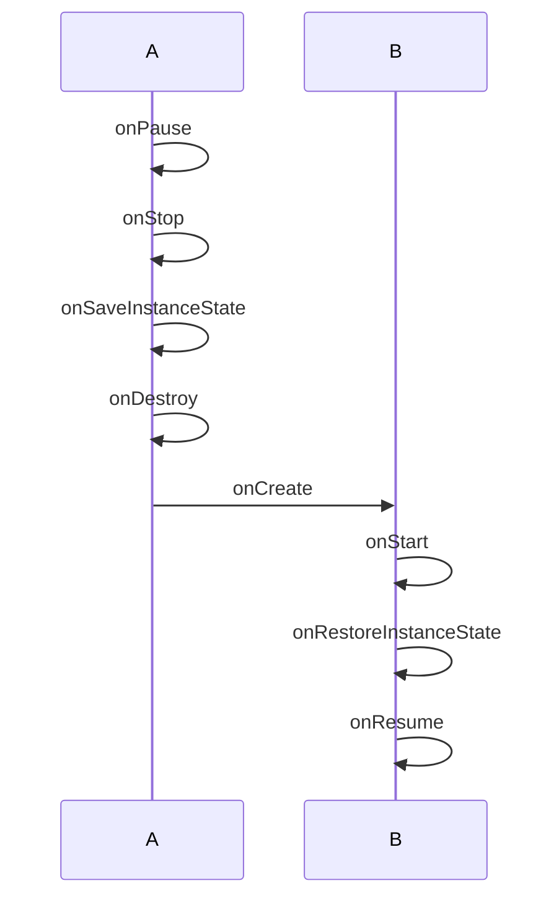
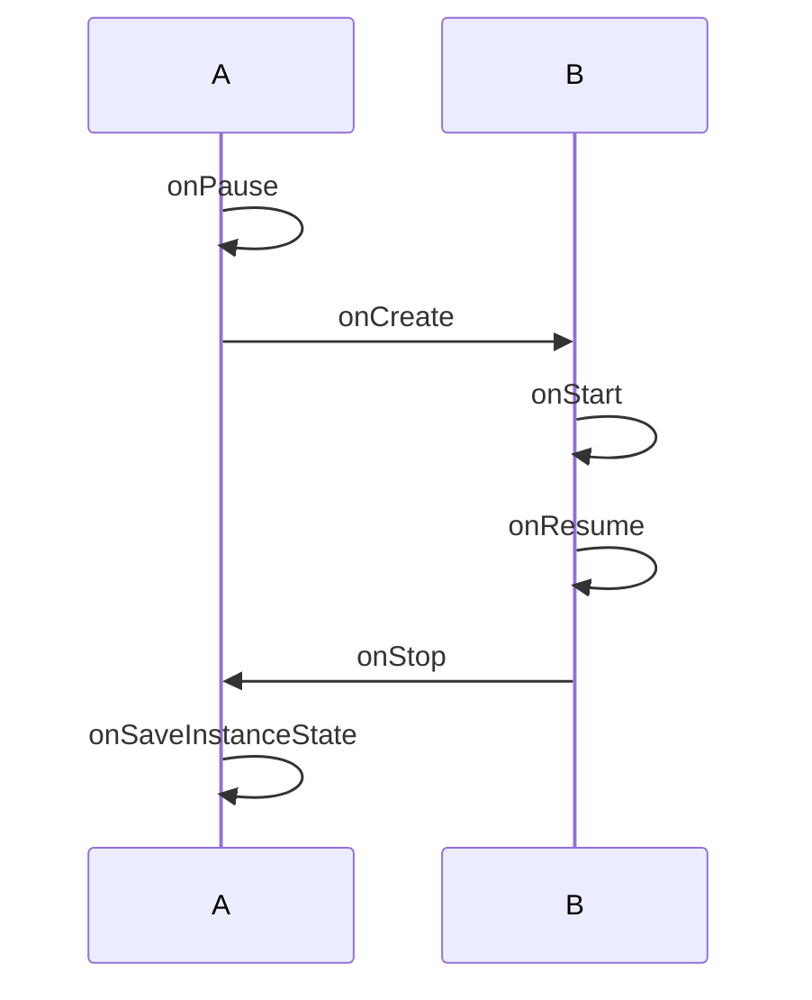
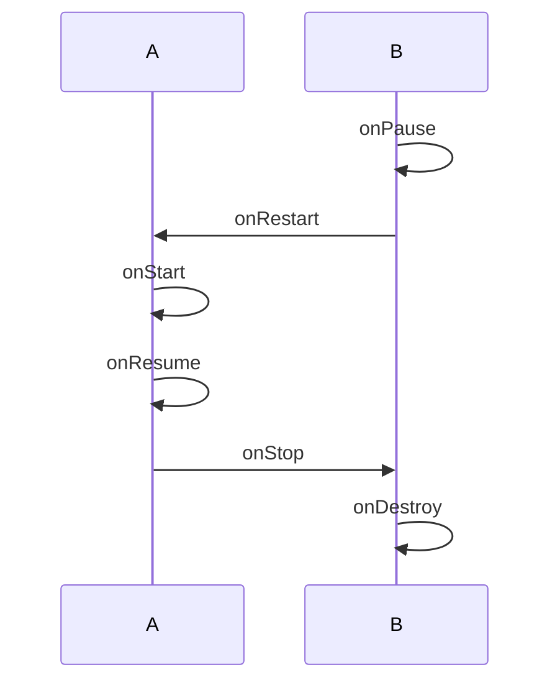
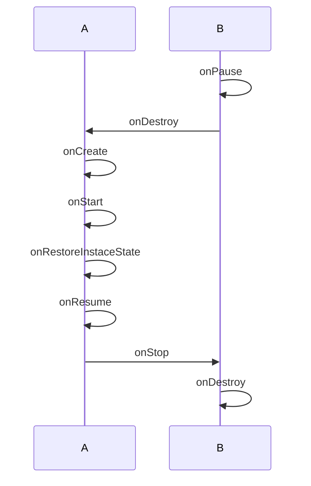
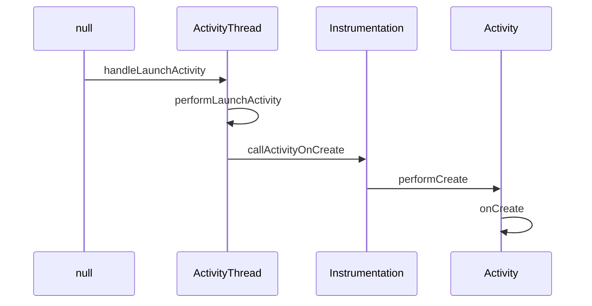
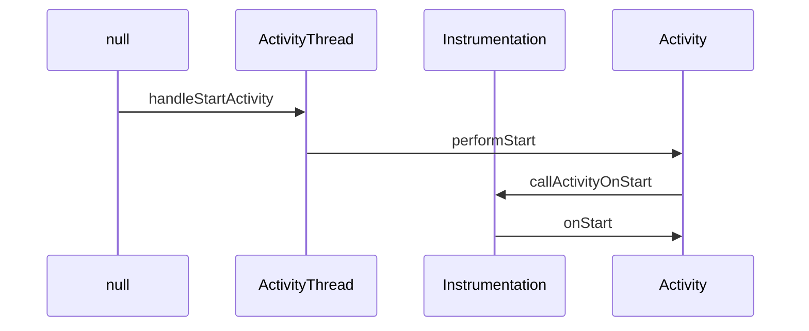
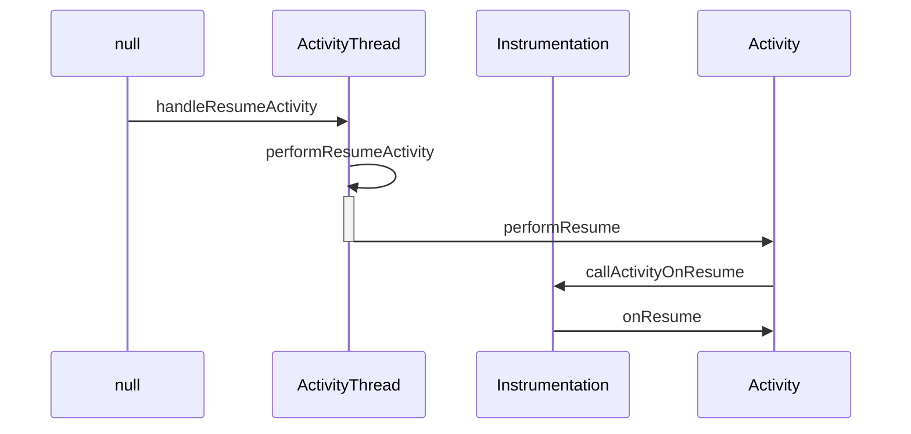

[toc]
# Activity常见方法

| 方法名称                                                     | 作用                                                         |
| ------------------------------------------------------------ | ------------------------------------------------------------ |
| void startActivityForResult(Intent intent, int requestCode)  | 需要返回值的方式启动一个activity                             |
| void setResult(int resultCode, Intent data)                  | 设置activity的返回值，resultCode默认为RESULT_CANCELED，可以设置为RESULT_OK |
| void onActivityResult(int requestCode, int resultCode, Intent data) | 重写这个方法可以用于回去activity的返回值                     |
| void onSaveInstanceState(Bundle outState)                    | 在activity被销毁时候可以把数据保存到Bundle中                 |
| void onRestoreInstanceState(Bundle savedInstanceState)       | 重建时候恢复数据使用                                         |

# Activity切换

## 显式Intent

#### 传入Activity对象

```java
val intent = Intent(this, SecondActivity::class.java)
startActivity(intent)
```

#### 设置ComponentName
```kotlin
val intent = Intent()
intent.setClassName("com.jiangker.testitem","com.jiangker.testitem.SecondActivity")
startActivity(intent)
```
ComponentName中的值
- className: com.jiangker.testitem.SecondActivity
- shortClassName: .SecondActivity
- packageName: com.jiangker.testitem

## 隐式Intent
不用明确指出我们想要启动哪一个活动，而是指定一系列更为抽象的action和category

#### action 
    intent-filter中可以设置多个，intent中可以设置一个，但必须是其中的一个
#### category

intent中可以没有，有的情况必须是intent-filter的子集，并且intent-filter中必须要有`android.intent.category.DEFAULT`才能被隐式启动
```xml
<intent-filter>
    <action android:name="android.intent.action.TEST"/>
    <category android:name="android.intent.category.DEFAULT"/>
    <category android:name="android.intent.category.TEST"/>
</intent-filter>
```
```kotlin
val intent = Intent()
intent.action = "android.intent.action.TEST"
intent.addCategory("android.intent.action.TEST")
startActivity(intent)
```

#### 同时具有这两个标签的都会在桌面生成图标作为主入口

 ```xml
 <intent-filter>
    <action android:name="android.intent.action.MAIN" />
    <category android:name="android.intent.category.LAUNCHER" />
</intent-filter>
 ```
#### data
如果intent-filter中有的类型，intent中必须有，重复的类型只需要满足其中一个即可。当intent-filter中没有的，intent也不能有

```xml
<data android:scheme="string"
    android:host="string"
    android:port="string"
    android:path="string"
    android:pathPattern="string"
    android:pathPrefix="string"
    android:mimeType="string"/>
```
data由两部分组成，mimeType和URL，mimeType指媒体类型，可以表示图片、文本、视频等不同的类型。而URI中可以包含很多数据，结构如：

```xml
<scheme>://<host>:port/[<path>]|<pathPrefix>|<pathPattern>|
```
URI默认值为content和file，是可以不写的
- Scheme:URI的模式，比如http、file、content等，如果URI中没有指定scheme，那么整个URI都是无效的
- Host：URI的主机名，比如www.baidu.com，如果host未指定，那么URI也是无效的
- Port：URI中的端口号，比如80，仅当URI中指定了scheme和host参数的时候，port才会有意义
- Path、pathPattern和pathPrefix：这三个表示路径信息，其中path表示完整的路径信息；pathPattern也表示完整的路径信息，但是它里面可以包含通配符“*”，“*”表示0个或多个任意字符；pathPrefix表示路径的前缀信息


#### 匹配检测

```kotlin
//检测有哪些匹配成功的，必须有android.intent.category.DEFAULT
val resolveInfoes: List<ResolveInfo> = packageManager.queryIntentActivities(intent,PackageManager.MATCH_DEFAULT_ONLY)
//如果只有一个匹配的就返回那个activity的信息，如果有多个则返回ResolveActivity
val resolveInfo :ResolveInfo = packageManager.resolveActivity(intent,PackageManager.MATCH_DEFAULT_ONLY)
```


# 启动模式

活动的启动模式一共有四种，分别是standard、singleTop、singleTask、singleInstance，可以在AndroidManifest.xml中通过给<activity标签指定android:launchMode属性来选择启动模式，Activity所需要的任务栈的名字为应用的包名，也可以使用TaskAffinity属性来指定，代码设置的启动模式优先级高于xml配置的，但singleInstance无法使用代码实现。Activity默认启动都是在启动他的栈中，除了singleInstance。

#### standard
- 是默认的启动模式，每启动一个新的活动，它就会在返回栈中入栈，并处于栈顶的位置，不在乎这个活动是否已经在返回栈中存在
- 每次启动都会创建该活动的一个新的实例,并放入当前activity的栈中，当启动它的没有返回栈，则会报错，如context调用的startActivity
- 若启动它的activity为singleInstance模式或者采用的是FLAG_ACTIVITY_NEW_TASK则会放入到自己原来实例的栈

#### singleTop
- 当活动的启动模式指定为singleTop，在启动活动时如果发现返回栈的栈顶已经是该活动，则认为可以直接使用它，不会再创建新的活动实例，即若不是栈顶，则会创建新的实例
- 得到复用时会调用自己的onNewIntent方法（onPause -> onNewIntent -> onResume 或 onRestart -> onStart -> onNewIntent -> onResume）


#### singleTask
- 当活动的启动模式指定为singleTask，每次启动该活动时系统首先会在返回栈中检查是否存在该活动的实例，如果发现已经存在则使用该实例，<u>并把这个活动之上的所有活动统统出栈</u>，如果没有发现就会创建一个新的活动实例
- 配合taskAffinity使用会出现在另外的栈中
- 触发复用时和singleTop一样的流程

#### singleInstance 
- 指定为singleInstance模式的活动会启动一个新的返回栈来管理这个活动
- 这个栈只会有一个实例，启动别的activity会放到自己原来的栈中

# 生命周期

Activity是由Activity栈进管理，当来到一个新的Activity后，此Activity将被加入到Activity栈顶，之前的Activity位于此Activity底部。Acitivity一般意义上有四种状态：
1. 当Activity位于栈顶时，此时正好处于屏幕最前方，此时处于运行状态；
2. 当Activity失去了焦点但仍然对用于可见（如栈顶的Activity是透明的或者栈顶Activity并不是铺满整个手机屏幕），此时处于暂停状态；
3. 当Activity被其他Activity完全遮挡，此时此Activity对用户不可见，此时处于停止状态；
4. 当Activity由于人为或系统原因（如低内存等）被销毁，此时处于销毁状态；

5. 因为activity需要先执行onpause才能启动上一个activity，所以onpause不能执行重量级操作。


## 生命周期实例

#### 1. 生命周期说明

 

#### 2. 旋转屏幕（配置改变）



#### 3. 配置Configuration之后

在对应的AndroidManifest.xml文件中对应的Activity下添加属性
```xml
android:configChanges="orientation|screenSize"
```

之后进行旋转对应的Activity只会触发 **onConfigurationChanged(newConfig : Configuration)** 方法

#### 4. 用户从A跳转到B（B不可见）



#### 5. 从B回退到A



#### 6. B经过旋转之后再回退到A



#### 7. onActivityResult执行在onRestart之前

# ActivityThread相关

> 基于源码android sdk 29

#### onCreate触发流程




#### onStart触发流程



#### onResume触发流程



