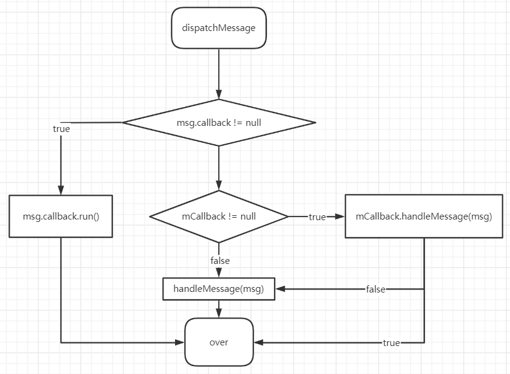

## 使用

创建哪个线程的handler，这个线程必须要有looper

handler的时间指的是开机之后的毫秒数
```kotlin
SystemClock.uptimeMillis()
```


#### 主线程handler的一般使用

```kotlin
//创建主线程的handler
private val handler = object :Handler(Looper.getMainLooper()){
    override fun handleMessage(msg: Message) {
        super.handleMessage(msg)
    }
}
//发送消息到消息队列，消息由这个handler的handleMessage处理
handler.sendMessage(Message.obtain())
//打包成message发送，最后回调这个runnable
handler.post {  }
```

#### 子线程handler的创建

```kotlin
//创建当前线程的looper对象
Looper.prepare()
val handler = object :Handler(Looper.myLooper()){
    override fun handleMessage(msg: Message) {
        super.handleMessage(msg)
    }
}
//开启循环
Looper.loop()
```

## 原理

> Android App是由事件驱动的GUI程序，所以应用程序的主入口mian函数的职责如下：
> - 初始化
> - 进入死循环，处理各种事件
>
> 所以handler总的来说就是：Looper不断获取MessageQueue中的一个Message，然后由Handler来处理。

## 1 Handler
### 1.1 Handler的主要职责
- 处理Message，这是它作为“处理者”的本职所在
- 将某个Message压入MessageQueue中

### 1.2 Handler的事件分发
#### 1.2.1 代码分析
```
public class Handler {

    final Callback mCallback;
    final Looper mLooper;
    final MessageQueue mQueue;
    //默认只能发同步消息，所以一般为false
    final boolean mAsynchronous;

    public Handler() {
        this(null, false);
    }

    public Handler(@Nullable Callback callback) {
        this(callback, false);
    }

    public Handler(@Nullable Callback callback, boolean async){
        mLooper = Looper.myLooper();
        //必须由looper才能创建handler
        if (mLooper == null) {
            throw new RuntimeException(
                    "Can't create handler inside thread " + Thread.currentThread()
                            + " that has not called Looper.prepare()");
        }
        mQueue = mLooper.mQueue;
        mCallback = callback;
        mAsynchronous = async;
    }

    private boolean enqueueMessage(@NonNull MessageQueue queue, @NonNull Message msg, long uptimeMillis) {
        msg.target = this;
        if (mAsynchronous) {
            //设置为异步消息
            msg.setAsynchronous(true);
        }
        return queue.enqueueMessage(msg, uptimeMillis);
    }

    public void dispatchMessage(@NonNull Message msg) {
        if (msg.callback != null) {
            //如果发送的是一个runable对象，则回调run方法
            handleCallback(msg);
        } else {
            if (mCallback != null) {
                //如果handler设置了统一处理的callback，则交由处理
                if (mCallback.handleMessage(msg)) {
                    return;
                }
            }
            //handler自己处理
            handleMessage(msg);
        }
    }

    /**
     * 重写这个方法，处理消息
     * @param msg
     */
    public void handleMessage(@NonNull Message msg) {
    }

    private static void handleCallback(Message message) {
        message.callback.run();
    }

    public interface Callback{
        boolean handleMessage(@Nullable Message msg);
    }
}

```

#### 1.2.2 派发事件逻辑图



### 1.3 Handler与Thread的联系

1. 每个Thread只对应一个Looper (Looper中的静态ThreadLocal中，只能初始化一次，Looper的操作方法都是操作的对应自己线程的looper对象)
2. 每个Looper只对应一个MessageQueue（Looper中有一个MessageQueue对象）
3. 每个MessageQueue中有N个Message 
4. 每个Message最多由一个handler处理

## 2. MessageQueue
消息队列，具有“队列”的所有常规操作。
### 2.1 常用方法

| 方法名称                                                  | 说明                                              |
| --------------------------------------------------------- | ------------------------------------------------- |
| boolean enqueueMessage(Message msg, long when)            | 元素入队                                          |
| Message next()                                            | 元素出队                                          |
| void removeMessages(Handler h, int what, Object object)   | 元素出队                                          |
| void removeMessages(Handler h, Runnable r, Object object) | 元素出队                                          |
| void quit(boolean safe)                                   | true表示推出当前时间之后的事件，false表示全部事件 |

```java
public final class MessageQueue {

    private final boolean mQuitAllowed;
    private boolean mQuitting;
    Message mMessages;

    private final ArrayList<IdleHandler> mIdleHandlers = new ArrayList<>();

    MessageQueue(boolean quitAllowed){
        mQuitAllowed = mQuitting;
    }

    public int postSyncBarrier() {
        return postSyncBarrier(SystemClock.uptimeMillis());
    }

    private int postSyncBarrier(long when) {
        synchronized (this) {
            final int token = mNextBarrierToken++;
            final Message msg = Message.obtain();
            msg.markInUse();
            msg.when = when;
            msg.arg1 = token;

            Message prev = null;
            Message p = mMessages;
            if (when != 0) {
                while (p != null && p.when <= when) {
                    prev = p;
                    p = p.next;
                }
            }
            if (prev != null) { // invariant: p == prev.next
                msg.next = p;
                prev.next = msg;
            } else {
                msg.next = p;
                mMessages = msg;
            }
            return token;
        }
    }
    
    public void removeSyncBarrier(int token) {
        // Remove a sync barrier token from the queue.
        // If the queue is no longer stalled by a barrier then wake it.
        synchronized (this) {
            Message prev = null;
            Message p = mMessages;
            while (p != null && (p.target != null || p.arg1 != token)) {
                prev = p;
                p = p.next;
            }
            if (p == null) {
                throw new IllegalStateException("The specified message queue synchronization "
                        + " barrier token has not been posted or has already been removed.");
            }
            final boolean needWake;
            if (prev != null) {
                prev.next = p.next;
                needWake = false;
            } else {
                mMessages = p.next;
                needWake = mMessages == null || mMessages.target != null;
            }
            p.recycleUnchecked();

            // If the loop is quitting then it is already awake.
            // We can assume mPtr != 0 when mQuitting is false.
            if (needWake && !mQuitting) {
                nativeWake(mPtr);
            }
        }
    }

    boolean enqueueMessage(Message msg, long when) {
        if (msg.target == null) {
            throw new IllegalArgumentException("Message must have a target.");
        }
        //如果已经插入到了队列中的消息不能重复放入
        if (msg.isInUse()) {
            throw new IllegalStateException(msg + " This message is already in use.");
        }

        synchronized (this) {
            if (mQuitting) {
                IllegalStateException e = new IllegalStateException(
                        msg.target + " sending message to a Handler on a dead thread");
                Log.w(TAG, e.getMessage(), e);
                msg.recycle();
                return false;
            }

            msg.markInUse();
            msg.when = when;
            Message p = mMessages;
            boolean needWake;
            if (p == null || when == 0 || when < p.when) {
                // New head, wake up the event queue if blocked.
                msg.next = p;
                mMessages = msg;
                needWake = mBlocked;
            } else {
                // Inserted within the middle of the queue.  Usually we don't have to wake
                // up the event queue unless there is a barrier at the head of the queue
                // and the message is the earliest asynchronous message in the queue.
                needWake = mBlocked && p.target == null && msg.isAsynchronous();
                Message prev;
                for (;;) {
                    prev = p;
                    p = p.next;
                    //相同时间的消息，插入到之后
                    if (p == null || when < p.when) {
                        break;
                    }
                    if (needWake && p.isAsynchronous()) {
                        needWake = false;
                    }
                }
                msg.next = p; // invariant: p == prev.next
                prev.next = msg;
            }

            // We can assume mPtr != 0 because mQuitting is false.
            if (needWake) {
                nativeWake(mPtr);
            }
        }
        return true;
    }


    @UnsupportedAppUsage
    Message next() {
        int pendingIdleHandlerCount = -1; // -1 only during first iteration
        int nextPollTimeoutMillis = 0;
        for (;;) {
            synchronized (this) {
                // Try to retrieve the next message.  Return if found.
                final long now = SystemClock.uptimeMillis();
                Message prevMsg = null;
                Message msg = mMessages;
                if (msg != null && msg.target == null) {
                    // Stalled by a barrier.  Find the next asynchronous message in the queue.
                    do {
                        prevMsg = msg;
                        msg = msg.next;
                    } while (msg != null && !msg.isAsynchronous());
                }
                if (msg != null) {
                    if (now < msg.when) {
                        // Next message is not ready.  Set a timeout to wake up when it is ready.
                        nextPollTimeoutMillis = (int) Math.min(msg.when - now, Integer.MAX_VALUE);
                    } else {
                        // Got a message.
                        mBlocked = false;
                        if (prevMsg != null) {
                            prevMsg.next = msg.next;
                        } else {
                            mMessages = msg.next;
                        }
                        msg.next = null;
                        msg.markInUse();
                        return msg;
                    }
                } else {
                    // No more messages.
                    nextPollTimeoutMillis = -1;
                }

                // Process the quit message now that all pending messages have been handled.
                if (mQuitting) {
                    return null;
                }

                // If first time idle, then get the number of idlers to run.
                // Idle handles only run if the queue is empty or if the first message
                // in the queue (possibly a barrier) is due to be handled in the future.
                if (pendingIdleHandlerCount < 0
                        && (mMessages == null || now < mMessages.when)) {
                    pendingIdleHandlerCount = mIdleHandlers.size();
                }
                if (pendingIdleHandlerCount <= 0) {
                    // No idle handlers to run.  Loop and wait some more.
                    mBlocked = true;
                    continue;
                }

                if (mPendingIdleHandlers == null) {
                    mPendingIdleHandlers = new IdleHandler[Math.max(pendingIdleHandlerCount, 4)];
                }
                mPendingIdleHandlers = mIdleHandlers.toArray(mPendingIdleHandlers);
            }

            // Run the idle handlers.
            // We only ever reach this code block during the first iteration.
            for (int i = 0; i < pendingIdleHandlerCount; i++) {
                final android.os.MessageQueue.IdleHandler idler = mPendingIdleHandlers[i];
                mPendingIdleHandlers[i] = null; // release the reference to the handler

                boolean keep = false;
                try {
                    keep = idler.queueIdle();
                } catch (Throwable t) {
                    Log.wtf(TAG, "IdleHandler threw exception", t);
                }

                if (!keep) {
                    synchronized (this) {
                        mIdleHandlers.remove(idler);
                    }
                }
            }

            // Reset the idle handler count to 0 so we do not run them again.
            pendingIdleHandlerCount = 0;

            // While calling an idle handler, a new message could have been delivered
            // so go back and look again for a pending message without waiting.
            nextPollTimeoutMillis = 0;
        }
    }


    void quit(boolean safe) {
        if (!mQuitAllowed) {
            throw new IllegalStateException("Main thread not allowed to quit.");
        }

        synchronized (this) {
            if (mQuitting) {
                return;
            }
            mQuitting = true;

            if (safe) {
                removeAllFutureMessagesLocked();
            } else {
                removeAllMessagesLocked();
            }

            // We can assume mPtr != 0 because mQuitting was previously false.
            nativeWake(mPtr);
        }
    }

    private void removeAllMessagesLocked() {
        Message p = mMessages;
        while (p != null) {
            Message n = p.next;
            p.recycleUnchecked();
            p = n;
        }
        mMessages = null;
    }

    private void removeAllFutureMessagesLocked() {
        final long now = SystemClock.uptimeMillis();
        Message p = mMessages;
        if (p != null) {
            if (p.when > now) {
                removeAllMessagesLocked();
            } else {
                Message n;
                for (;;) {
                    n = p.next;
                    if (n == null) {
                        return;
                    }
                    if (n.when > now) {
                        break;
                    }
                    p = n;
                }
                p.next = null;
                do {
                    p = n;
                    n = p.next;
                    p.recycleUnchecked();
                } while (n != null);
            }
        }
    }

    public static interface IdleHandler {
        boolean queueIdle();
    }
}
```
## 3 Looper
```java
public final class Looper {
    
    static final ThreadLocal<Looper> sThreadLocal = new ThreadLocal<>();
    private static Looper sMainLooper;
    final MessageQueue mQueue;
    final Thread mThread;
    
    private Looper(boolean quitAllowed){
        mQueue = new MessageQueue(quitAllowed);
        mThread = Thread.currentThread();
    }
    
    public static void prepare(){
        prepare(true);
    }
    
    private static void prepare(boolean quitAllowed){
        //一个线程中只能有一个Looper对象
        if (sThreadLocal.get() != null) {
            throw new RuntimeException("Only one Looper may be created per thread");
        }
        sThreadLocal.set(new Looper(quitAllowed));
    }
    
    public void quit(){
        mQueue.quit(false);
    }
    
    public void quitSafely(){
        mQueue.quit(true);
    }

    public static void prepareMainLooper() {
        prepare(false);
        synchronized (Looper.class) {
            //确保主线程只有一个
            if (sMainLooper != null) {
                throw new IllegalStateException("The main Looper has already been prepared.");
            }
            sMainLooper = myLooper();
        }
    }

    public static @Nullable Looper myLooper() {
        return sThreadLocal.get();
    }

    public static void loop() {
        final Looper me = myLooper();
        if (me == null) {
            throw new RuntimeException("No Looper; Looper.prepare() wasn't called on this thread.");
        }
        final MessageQueue queue = me.mQueue;
        //无限的去拿消息，防止线程结束
        for (;;) {
            Message msg = queue.next(); // might block
            if (msg == null) {
                // No message indicates that the message queue is quitting.
                return;
            }
            try {
                msg.target.dispatchMessage(msg);
            } catch (Exception exception) {
                //捕获异常，防止线程退出
            }
        }
    }
}
```
## 4 Message

```java
public final class Message implements Parcelable {

    // 用户自定义，主要用于辨别Message的类型
    public int what;
    // 用于存储一些整型数据
    public int arg1;
    public int arg2;
    // 可放入一个可序列化对象
    public Object obj;
    // Bundle数据
    Bundle data;
    // Message处理的时间。开机时间而言的
    // 对用户不可见
    public long when;
    // 处理这个Message的Handler
    // 对用户不可见
    Handler target;
    // 当我们使用Handler的post方法时候就是把runnable对象封装成Message
    // 对用户不可见
    Runnable callback;
    // MessageQueue是一个链表，next表示下一个
    // 对用户不可见
    Message next;

}
```


- quit()立即退出，清空所有消息。quitSafely()清除当前时间之后的消息，已到期未执行的继续执行。

- Handler的添加Message方法可以把消息添加到头部，也可以添加到末尾或者延时以及添加指定时间的。
- Handler中有一个不对外开放的值mAsynchronous，可以设置为true，这个handler发生的都是同步消息了，通过对msg设置一个标志实现的，当然也可以直接调用来使消息为同步消息，当从队列中获取消息时，碰到了target为空的消息则表示开启消息屏障，只处理异步消息。
- 添加了同步屏障之后，完成了同步消息需要及时移除同步屏障。
- Handler中同时持有Looper和MessageQueue对象，用于向队列中添加Message。

- 因为添加到队列时会设置一个标志，同一个message不能被添加两次，不同的队列也不行。
- post方式发送的消息都由Runnable自己处理，message的消息可以由handleMessage以及Handler中的Callback一起处理。
- msg中的时间时SystemLock时间，手机开机的时间。
- 空闲时间执行的IdleHandler，可以通过Looper来获取队列，向队列中添加空闲任务，当队列为空时或没到队列第一个任务执行时间时（即屏障状态下没有异步任务也不会执行），开始执行空闲队列的任务，会一次性执行完空闲列表中的所有当前存在的任务。空闲任务继承至IdleHandler接口，若queueIdle()返回为true则这个任务不主动移除，每次都会执行。

- 获取消息时最好使用obtain从缓存里面获取，处理完的消息默认都会放入消息缓存，最大容量为50。类似于MessageQueue一样的利用next的链表队列。