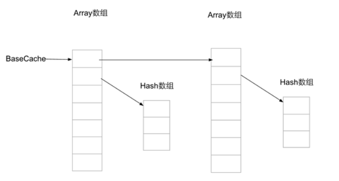

[代码测试](../../calculate/src/androidTest/jfp/study/calculate/ExampleInstrumentedTest.kt)

- 双数组结构，一个存储key的hash值，另外一个存储key以及value，key的index = hash * 2，value的index = hash * 2 + 1

- 和SparseArray一样是二分法查找，不同的是添加和删除都需要移动。

- 会缓存4个以及8个长度的hash数组以及对应长度的KeyValue数组。

- 若存在hash冲突，则会向前以及向后查找所有hash值一样的元素，若key都不相同则返回最后hash值相等的位置。