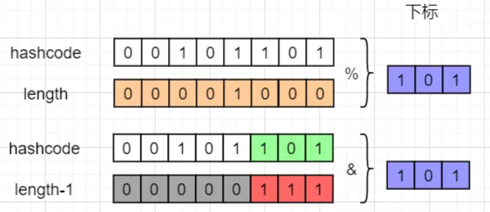
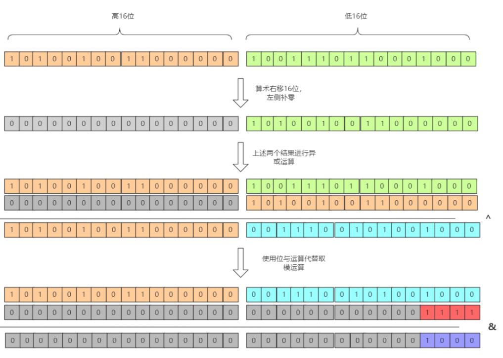
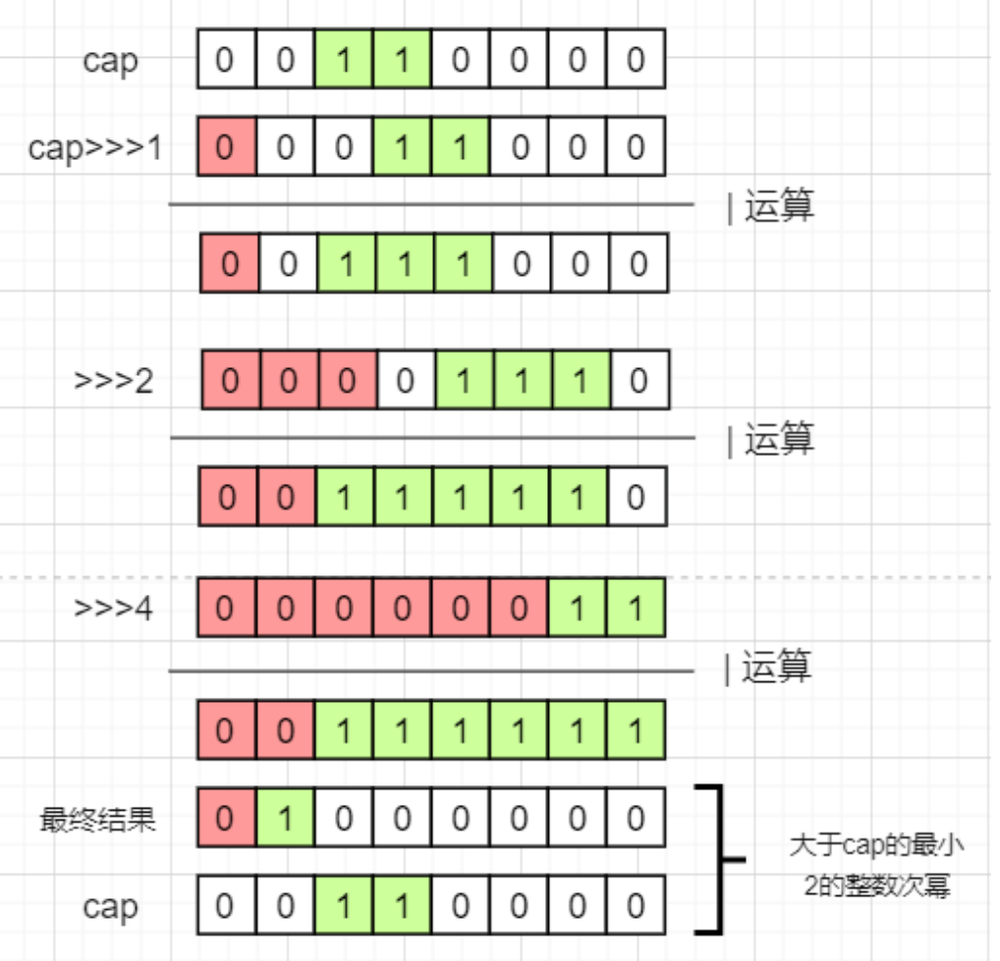

[HashMap剖析](https://mp.weixin.qq.com/s/8lIcCBGzWL0L3yIv4OgfDg)

- key和value都可以为空，线程不安全，容易丢失以及死链

- hash生成方法

  ```java
  static final int hash(Object key) {
      int h;
      // 高16位和低16位进行异或
      return (key == null) ? 0 : (h = key.hashCode()) ^ (h >>> 16);
  }
  ```

- index下标计算为hash值与数组长度减一取与运算

  

- 完整的index计算过程

  

- 数组的长度使用为2的整数次幂。若非2的整数次幂则向上取整。减一是防止刚好为2次幂时最后的加一操作会导致成为2倍。

  ```java
  static final int tableSizeFor(int cap) {
      // 注意这里必须减一
      int n = cap - 1;
      n |= n >>> 1;
      n |= n >>> 2;
      n |= n >>> 4;
      n |= n >>> 8;
      n |= n >>> 16;
      return (n < 0) ? 1 : (n >= MAXIMUM_CAPACITY) ? MAXIMUM_CAPACITY : n + 1;
  }
  ```

  

- Hash冲突
  - 当链表的长度>=8且数组长度>=64时，会把链表转化成红黑树。
  - 当链表长度>=8，但数组长度<64时，会优先进行扩容，而不是转化成红黑树。
  - 当红黑树节点数<=6，自动转化成链表，为尾插法。
  
- 扩容因子为0.75，扩容为原来的两倍。新位置取决于高一位的数值。

- hashMap的key重写equals方法时也需要重写hashCode方法，因为是hashCode相等情况才进行equals判断的(判断的是前16位与后16位取异或的结构)。

- 不带自动的缩容，序列化是单独重写的方法去完成，减少空间的浪费。