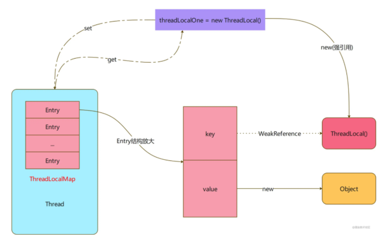

## 使用

> 同一个对象，在不同的线程中可以维持不同的值

[代码示例](../../../language/src/test/java/jfp/study/language/ThreadLocalTest.kt)

```kotlin
val localName = ThreadLocal<String>()
val name = "jiangker"
localName.set(name)
// 正确
Assert.assertEquals(name,localName.get())
thread {
    // java.lang.AssertionError: expected:<jiangker> but was:<null>
    Assert.assertEquals(name,localName.get())
}
```

- ThreadLocal并不存储值，value是存储在Thread中一个ThreadLocal的ThreadLocalMap的静态内部类中的。
- ThreadLocalMap实际是一个默认的容量为16的Entry的循环数组，当容量超过最大2/3的时候会进行清理操作，若还大于2/3*3/4则扩容为原来的两倍。

- Entry是一个key为弱引用包裹的ThreadLocal，value为object
- Entry存储在ThreadLocal的hashCode对length长度-1取与的位置，若已经存在Entry且Key中不为空则向后遍历找寻可以插入的位置。

- 若ThreadLocal不使用时不进行remove操作，value会被泄漏。但若进行了别的ThreadLocal的操作，可能才会对空的Entry进行清空。

- 在set操作时，会对部分元素进行检测，若遇到key为空的Entry，则执行清理操作，并对之后的元素重写进行hash操作。
- 在remove操作时，也会对此元素之后连续非空的元素进行检查并且rehash。



#### 参考文章

[ThreadLocal的奇思妙想](https://juejin.cn/post/6958991265933295624#heading-0)

