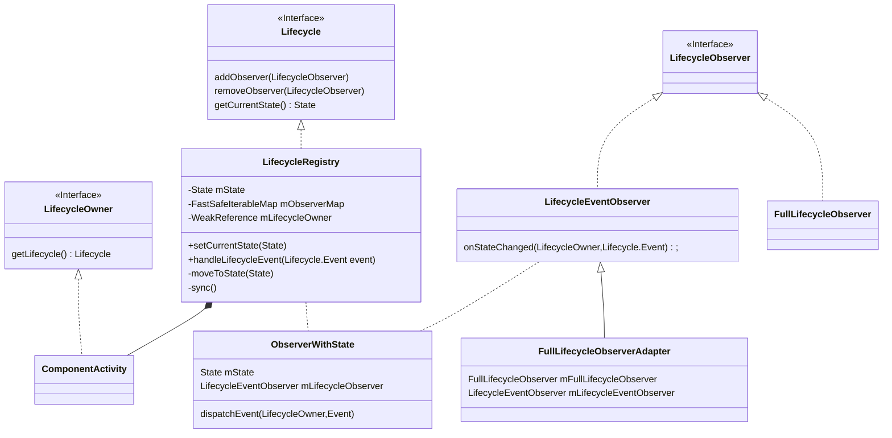
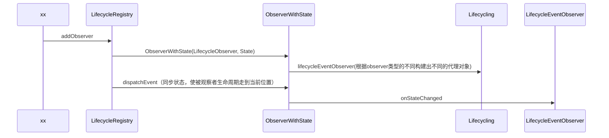

## 基础使用

在Android框架中定义的许多应用组件都存在着生命周期（例如Activity、Fragment）。组件的生命周期由操作系统中运行的框架代码管理。它们是Android工作原理的核心，应用必须遵守规则，否则会造成内存泄露以及应用的崩溃。应用中有很多组件需要在创建时注册绑定，在可见时运作，在不可见时停止，在销毁时解除绑定，许许多多的操作都与生命周期密切相关。所以这时如果需要添加到生命周期的方法过多时就很容易混乱、难以维护，所以通常我们可以如下做

```kotlin
// 定义生命周期方法
interface LifeListener {
    fun onCreate()
    fun onStart()
    fun onStop()
    fun onDestroy()
}
// 基类中集成
open class BaseActivity : AppCompatActivity() {

    protected val list = mutableListOf<LifeListener>()

    override fun onCreate(savedInstanceState: Bundle?) {
        super.onCreate(savedInstanceState)
        list.forEach { it.onCreate() }
    }

    override fun onStart() {
        super.onStart()
        list.forEach { it.onStart() }
    }

    override fun onStop() {
        super.onStop()
        list.forEach { it.onStop() }
    }

    override fun onDestroy() {
        super.onDestroy()
        list.forEach { it.onStop() }
    }
}
```

而现在的AppCompatActivity已经集成了相关可以很方便管理组件生命周期的方法的内容，那就是Lifecycle

### Lifecycle

Lifecycle可以用于储存相关组件的生命周期状态信息，是一个被观察者并允许其他实现了LifecycleObserver的对象观察此状态。Lifecycle中有两种主要的枚举用于表示生命周期状态以及变化动作

- Events 生命周期事件，对应于Activity和Fragment中的回调事件

- States 表示当前所处生命周期状态

官网有一张图，很清晰的表明了State与Event的关系


State从左到右表示状态的提升对应up，从右往左即为状态的下降对应down

### LifecycleOwner

这是一个接口，实现这个接口的类表示具有Lifecycle。实现LifecycleObserver的组件可以很完美的与实现LifecycleOwner的组件配合，LifecycleOwner提供生命周期Lifecycle，LifecycleObserver可以注册以观察生命周期。

```kotlin
lifecycle.addObserver(object :LifecycleEventObserver{
    override fun onStateChanged(source: LifecycleOwner, event: Lifecycle.Event) {
		
    }
})
```

也可以添加依赖

```groovy
implementation "android.arch.lifecycle:common-java8:1.1.1"
```

然后重写自己想要监听的生命周期方法

```kotlin
lifecycle.addObserver(object :DefaultLifecycleObserver{
    override fun onCreate(owner: LifecycleOwner) {
        super.onCreate(owner)
    }
})
```

这样就可以很方便的制作自己生命周期相关的组件

```kotlin
class EventBusLifecycleObserver(
    private val activity: AppCompatActivity
) : DefaultLifecycleObserver {
    override fun onCreate(owner: LifecycleOwner) {
        super.onCreate(owner)
        EventBus.getDefault().register(activity)
    }

    override fun onDestroy(owner: LifecycleOwner) {
        super.onDestroy(owner)
        EventBus.getDefault().unregister(activity)
    }
}
override fun onCreate(savedInstanceState: Bundle?) {
    super.onCreate(savedInstanceState)
    DataBindingUtil.setContentView<ActivityMainBinding>(this, R.layout.activity_main)
    lifecycle.addObserver(EventBusLifecycleObserver(this))
}
```

目前Android默认实现了LifecycleOwner的只有Activity和Fragment，我们也可以继承LifecycleOwner接口，然后主动把事件转发到LifecycleRegistry。

```java
class MyActivity : Activity(), LifecycleOwner {

    private lateinit var lifecycleRegistry: LifecycleRegistry

    override fun onCreate(savedInstanceState: Bundle?) {
        super.onCreate(savedInstanceState)

        lifecycleRegistry = LifecycleRegistry(this)
        lifecycleRegistry.setCurrentState(Lifecycle.State.CREATED)
    }

    public override fun onStart() {
        super.onStart()
        lifecycleRegistry.setCurrentState(Lifecycle.State.STARTED)
    }

    override fun getLifecycle(): Lifecycle {
        return lifecycleRegistry
    }
}
```

## 实现原理：

主要可以从两个方面去看lifecycle怎么实现的

- 注册观察者时怎么把被观察者当前已有的状态同步过去的
- 以及lifecycle怎么得到生命周期事件并转发给观察者的。

首先看一下涉及到的主要类图



​	


LifecycleRegistry是Lifecycle的实现类，

- mState表示的是组件当前所处的生命周期状态
- mObserverMap是观察者对象以及观察者对象的包装类的容器
- 以及一些同步生命周期状态的方法，方法状态给观察者

ObserverWithState是观察者的包装类

- mState记录当前观察者已经同步到的状态
- mLifecycleObserver：当前观察者的代理类，方便把生命周期事件传递给观察者中正确的方法

FullLifecycleObserverAdapter主要处理观察者是FullLifecycleObserver的情况，把onStateChanged事件划分转发给FullLifecycleObserver对应的方法

```java
class FullLifecycleObserverAdapter implements LifecycleEventObserver {

    private final FullLifecycleObserver mFullLifecycleObserver;
    private final LifecycleEventObserver mLifecycleEventObserver;

    FullLifecycleObserverAdapter(FullLifecycleObserver fullLifecycleObserver,
            LifecycleEventObserver lifecycleEventObserver) {
        mFullLifecycleObserver = fullLifecycleObserver;
        mLifecycleEventObserver = lifecycleEventObserver;
    }

    @Override
    public void onStateChanged(@NonNull LifecycleOwner source, @NonNull Lifecycle.Event event) {
        switch (event) {
            case ON_CREATE:
                mFullLifecycleObserver.onCreate(source);
                break;
            case ON_START:
                mFullLifecycleObserver.onStart(source);
                break;
            case ON_RESUME:
                mFullLifecycleObserver.onResume(source);
                break;
            case ON_PAUSE:
                mFullLifecycleObserver.onPause(source);
                break;
            case ON_STOP:
                mFullLifecycleObserver.onStop(source);
                break;
            case ON_DESTROY:
                mFullLifecycleObserver.onDestroy(source);
                break;
            case ON_ANY:
                throw new IllegalArgumentException("ON_ANY must not been send by anybody");
        }
        if (mLifecycleEventObserver != null) {
            mLifecycleEventObserver.onStateChanged(source, event);
        }
    }
}
```

首先我们从addObserver方法开始看起，这个是在Lifecycle的接口当中的方法，而实现类为LifecycleRegistry，流程图大概如下



代码流程

```java
// LifecycleRegistry.java
@Override
public void addObserver(@NonNull LifecycleObserver observer) {
  	// 若当前状态不是销毁状态，则为初始状态
    State initialState = mState == DESTROYED ? DESTROYED : INITIALIZED;
  	// 生成一个带状态的事件转发的管理对象
    ObserverWithState statefulObserver = new ObserverWithState(observer, initialState);
    ObserverWithState previous = mObserverMap.putIfAbsent(observer, statefulObserver);
		// 若之前这个observer不存在则继续进行
    if (previous != null) {
        return;
    }
    LifecycleOwner lifecycleOwner = mLifecycleOwner.get();
    if (lifecycleOwner == null) {
        // it is null we should be destroyed. Fallback quickly
        return;
    }
	// 是否需要进行sync
    boolean isReentrance = mAddingObserverCounter != 0 || mHandlingEvent;
    // 计算要达到的状态
    State targetState = calculateTargetState(observer);
    mAddingObserverCounter++;
  	// 把statefulObserver的状态连续推进到页面当前状态，只有小于当前状态才推进
    while ((statefulObserver.mState.compareTo(targetState) < 0
            && mObserverMap.contains(observer))) {
        pushParentState(statefulObserver.mState);
        // 计算这个状态变化的下一个事件
        final Event event = Event.upFrom(statefulObserver.mState);
		statefulObserver.dispatchEvent(lifecycleOwner, event);
        popParentState();
        targetState = calculateTargetState(observer);
    }

    if (!isReentrance) {
        sync();
    }
    mAddingObserverCounter--;
}
```

所以这里最关键的就是ObserverWithState，这个包含了生命周期状态以及一个观察者的代理对象mLifecycleObserver。

```java
// LifecycleRegistry.ObserverWithState
ObserverWithState(LifecycleObserver observer, State initialState) {
  	// 根据observer的实际类型生成代理对象
    mLifecycleObserver = Lifecycling.lifecycleEventObserver(observer);
  	// 初始化状态
    mState = initialState;
}
```

```java
// Lifecycling
static LifecycleEventObserver lifecycleEventObserver(Object object) {
    boolean isLifecycleEventObserver = object instanceof LifecycleEventObserver;
    boolean isFullLifecycleObserver = object instanceof FullLifecycleObserver;
    if (isLifecycleEventObserver && isFullLifecycleObserver) {
        return new FullLifecycleObserverAdapter((FullLifecycleObserver) object,
                (LifecycleEventObserver) object);
    }
    if (isFullLifecycleObserver) {
        return new FullLifecycleObserverAdapter((FullLifecycleObserver) object, null);
    }
    if (isLifecycleEventObserver) {
        return (LifecycleEventObserver) object;
    }
    // 处理注解类型为OnLifecycleEvent.class的对象
    return new ReflectiveGenericLifecycleObserver(object);
}
```

执行生命周期事件传递

```java
// LifecycleRegistry.ObserverWithState
void dispatchEvent(LifecycleOwner owner, Event event) {
		// 获取执行event事件后的下一个生命周期状态
    State newState = getStateAfter(event);
    mState = min(mState, newState);
    // 使用刚才生成的代理状态分发生命周期事件
    mLifecycleObserver.onStateChanged(owner, event);
    mState = newState;
}
//Lifecycle.java
public State getTargetState() {
    switch (this) {
        case ON_CREATE:
        case ON_STOP:
            return State.CREATED;
        case ON_START:
        case ON_PAUSE:
            return State.STARTED;
        case ON_RESUME:
            return State.RESUMED;
        case ON_DESTROY:
            return State.DESTROYED;
        case ON_ANY:
            break;
    }
    throw new IllegalArgumentException(this + " has no target state");
} 
```

至此一个Lifecycle对象的观察者就添加完成了，那么Activity作为一个LifecycleOwner对象，怎么把生命周期改变的状态传递给LifecycleRegistry对象的呢。

这里主要使用了常用的三方库的方式，使用一个Fragment来分发相关的生命周期状态。

这里使用的是ReportFragment，下面是ReportFragment的相关代码

```java
// 
public class ReportFragment extends Fragment {
    private static final String REPORT_FRAGMENT_TAG = "androidx.lifecycle"
            + ".LifecycleDispatcher.report_fragment_tag";

    public static void injectIfNeededIn(Activity activity) {
        // FragmentActivity from support lib, so we use framework fragments for activities
        android.app.FragmentManager manager = activity.getFragmentManager();
        if (manager.findFragmentByTag(REPORT_FRAGMENT_TAG) == null) {
            manager.beginTransaction().add(new ReportFragment(), REPORT_FRAGMENT_TAG).commit();
            // Hopefully, we are the first to make a transaction.
            manager.executePendingTransactions();
        }
    }

    static ReportFragment get(Activity activity) {
        return (ReportFragment) activity.getFragmentManager().findFragmentByTag(
                REPORT_FRAGMENT_TAG);
    }

    private ActivityInitializationListener mProcessListener;

    @Override
    public void onActivityCreated(Bundle savedInstanceState) {
        super.onActivityCreated(savedInstanceState);
        dispatch(Lifecycle.Event.ON_CREATE);
    }

    @Override
    public void onStart() {
        super.onStart();
        dispatch(Lifecycle.Event.ON_START);
    }

    @Override
    public void onResume() {
        super.onResume();
        dispatch(Lifecycle.Event.ON_RESUME);
    }

    @Override
    public void onPause() {
        super.onPause();
        dispatch(Lifecycle.Event.ON_PAUSE);
    }

    @Override
    public void onStop() {
        super.onStop();
        dispatch(Lifecycle.Event.ON_STOP);
    }

    @Override
    public void onDestroy() {
        super.onDestroy();
        dispatch(Lifecycle.Event.ON_DESTROY);
    }

    private void dispatch(Lifecycle.Event event) {
        Activity activity = getActivity();
        // 分发事件
        if (activity instanceof LifecycleOwner) {
            Lifecycle lifecycle = ((LifecycleOwner) activity).getLifecycle();
            if (lifecycle instanceof LifecycleRegistry) {
                ((LifecycleRegistry) lifecycle).handleLifecycleEvent(event);
            }
        }
    }
}
```

通过injectIfNeededIn方法，使Fragment添加到Activity中，然后生命周期变化的时候，通过handleLifecycleEvent把生命周期方法转发给

LifecycleRegistry

```java
public void handleLifecycleEvent(@NonNull Lifecycle.Event event) {
    enforceMainThreadIfNeeded("handleLifecycleEvent");
    moveToState(event.getTargetState());
}
private void moveToState(State next) {
    if (mState == next) {
        return;
    }
    mState = next;
    // 如果正在进行事件的分发，则就不用重复进行了
    if (mHandlingEvent || mAddingObserverCounter != 0) {
        mNewEventOccurred = true;
        // we will figure out what to do on upper level.
        return;
    }
    mHandlingEvent = true;
    // 通知每一个观察者
    sync();
    mHandlingEvent = false;
}
```

```java
private void sync() {
    LifecycleOwner lifecycleOwner = mLifecycleOwner.get();
    if (lifecycleOwner == null) {
        throw new IllegalStateException("LifecycleOwner of this LifecycleRegistry is already"
                                        + "garbage collected. It is too late to change lifecycle state.");
    }
    while (!isSynced()) {
        mNewEventOccurred = false;
        // mObserverMap内部有一个hashMap储存元素同时也会储存到一个双链表中
        // 如果当前状态小于最后添加元素的状态，则倒序同步
        if (mState.compareTo(mObserverMap.eldest().getValue().mState) < 0) {
            backwardPass(lifecycleOwner);
        }
        Map.Entry<LifecycleObserver, ObserverWithState> newest = mObserverMap.newest();
        if (!mNewEventOccurred && newest != null
            && mState.compareTo(newest.getValue().mState) > 0) {
            // 从前往后同步
            forwardPass(lifecycleOwner);
        }
    }
    mNewEventOccurred = false;
}
private boolean isSynced() {
    if (mObserverMap.size() == 0) {
        return true;
    }
    State eldestObserverState = mObserverMap.eldest().getValue().mState;
    State newestObserverState = mObserverMap.newest().getValue().mState;
    // 首位元素都等于当前元素了表示同步完成了
    return eldestObserverState == newestObserverState && mState == newestObserverState;
}
```