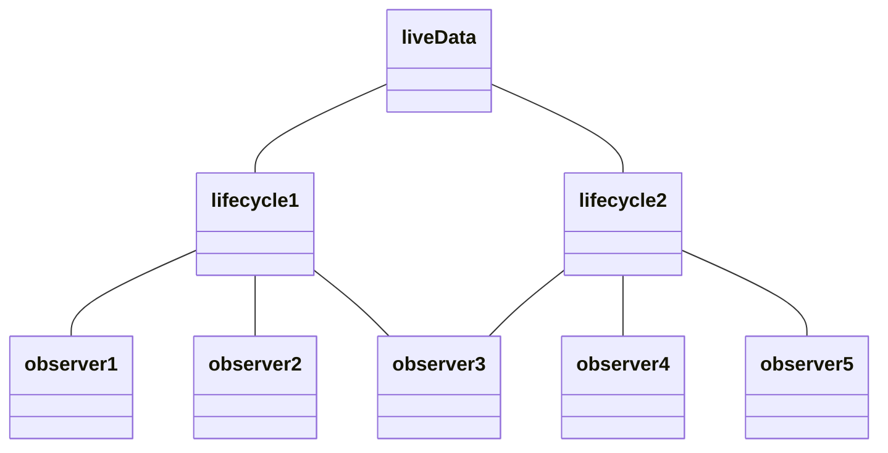
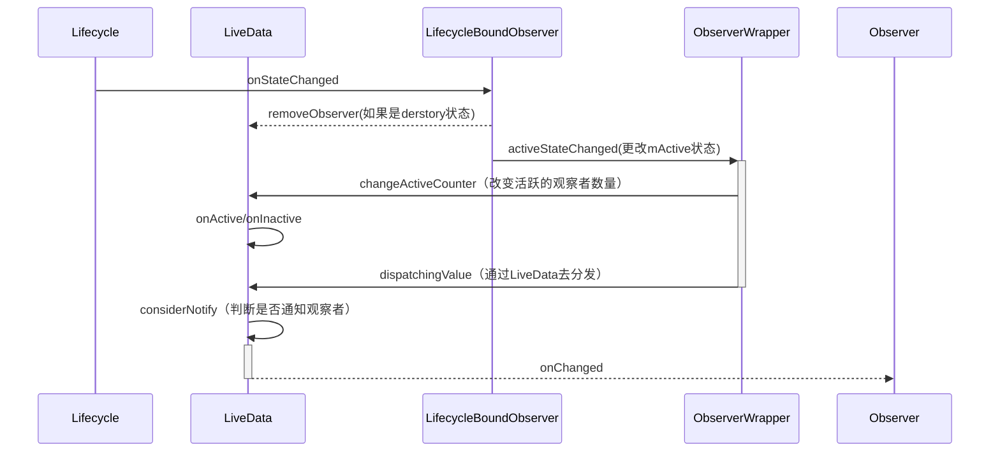
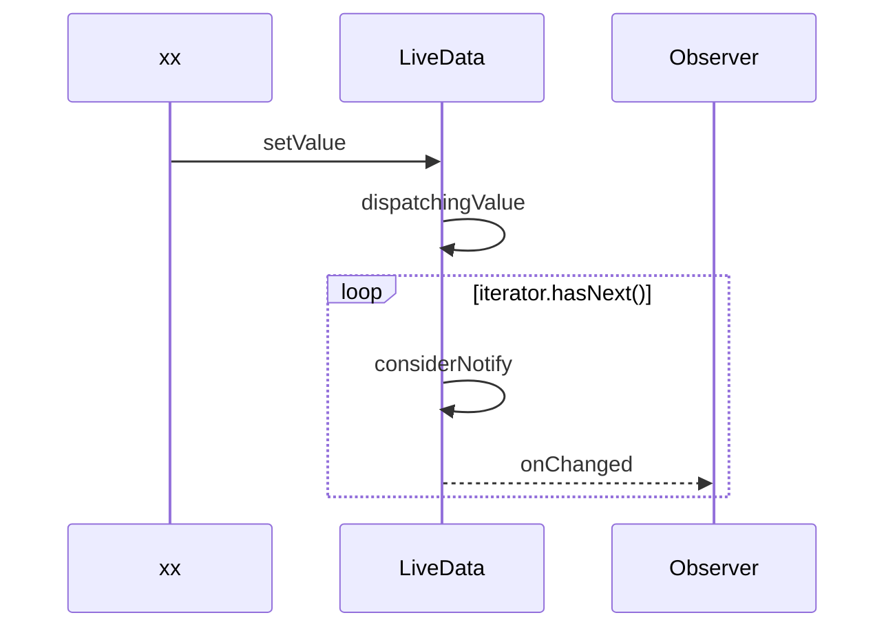

> [`LiveData`](https://developer.android.com/reference/androidx/lifecycle/LiveData) 是一种可观察的数据存储器类。与常规的可观察类不同，LiveData 具有生命周期感知能力，意指它遵循其他应用组件（如 Activity、Fragment 或 Service）的生命周期。这种感知能力可确保 LiveData 仅更新处于活跃生命周期状态的应用组件观察者，也会在应用组件销毁时自动取消关联。

## 基础使用

LiveData作为一个支持范型的数据对象，一般是放置在ViewModel中的。并且LiveData是一个抽象类，不能直接使用，只能使用其子类

```kotlin
class JetPackModel : ViewModel() {
    val count = MutableLiveData(0)
}
```

于此同时LiveData是一个被观察者，可以向其添加观察者对象，当内部的数据发生变化时会主动去通知观察者。所以被观察者一般都会具有以下类型的方法：

- 添加观察者的方法，observeForever(Observer<? super T> observer)向LiveData添加一个观察者

- 改变其内部的数据的方法，对应LiveData有setValue (必须主线程调用)和postValue(可以在子线程调用)，数据更改之后会去通知观察者，而这两个方法是protected的，不可以直接使用，需要使用其子类MutableLiveData

```kotlin
class JetPackModel : ViewModel() {
    private val _count = MutableLiveData(0)
    // 对外暴露不可变的LiveData
    val count: LiveData<Int> = _count

    fun click() {
        val value = _count.value ?: 0
        // setValue方法只能在主线程调用，会立即触发活跃状态观察者的Obsrever方法
        _count.value = value + 1
    }
    fun postClick(){
        val value = _count.value ?: 0
        // 会post到主线程中进行
        _count.postValue(value + 1)
    }
}
override fun onCreate(savedInstanceState: Bundle?) {
    // 当数据改变时会回调onChanged方法
    model.count.observeForever(object :Observer<Int>{
        override fun onChanged(t: Int?) {  
        }
    })
}
```

但是这样的被观察者在使用中需要在onDestory中主动去移除，否则会存在一些问题

- 当Activity销毁时，LiveData依旧会持有Observer对象，造成Activity的泄漏
- 此时LiveData的更新，很可能因为Activity的销毁而导致崩溃

但作为LiveData而言，是一个具有生命的Data，要解决上面的问题可以使用他的observe(LifecycleOwner owner, Observer<? super T> observer)，结合Lifecycle实现自动解绑可以有效的防止内存泄漏。与此同时，结合Lifecycle之后的LiveData还具有如下优势

- 只会去通知处于活跃状态的观察者。
- 当由非活跃状态改变为活跃状态时，若有新的数据会立即更新。

```kotlin
override fun onCreate(savedInstanceState: Bundle?) {
    // 当数据改变时会回调onChanged方法
    model.count.observe(this, object :Observer<Int>{
        override fun onChanged(t: Int?) {
        }
    })
}
```

当LiveData所装载的数据和想对外暴露的数据有所区别时，可以对其进行一定的转化。

```kotlin
private val _count = MutableLiveData<Int>()
val clickText: LiveData<String> = Transformations.map(_count){
    "this button click $it times"
}
```

当一个界面的数据依赖于多个数据源时，可以使用

LiveData还可以结合网络请求、Room、DataStore来使用，有助于界面上显示的数据与数据库中的保持一致。

## 实现原理

Q：LiveData作为一个可以结合生命周期使用的被观察者，他是怎么协同Lifecycle处理如下问题的呢？

- 生命周期结束时自动解绑
- 如何区分活跃状态于非活跃状态的观察者，指定更新活跃状态的观察者
- 观察者变为活跃状态时更新最新的数据

因为一个LiveData可以在绑定多个具有生命周期的观察者对象，且生命周期Lifecycle很可能是不同的，所以大致对应关系可能如下



为了区别观察者的状态去选择性的更新以及对Lifecycle状态改变时做出处理，LiveData就需要对observer进行包装，大概会涉及到如下几个类，都是LiveData的内部类

 ```mermaid
 classDiagram
 	class ObserverWrapper{
 		Observer mObserver
 		boolean mActive
 		int mLastVersion
 		shouldBeActive() boolean
 		activeStateChanged(boolean)
 	}
 	class LifecycleEventObserver{
 		<<interface>>
 		onStateChanged(LifecycleOwner,Lifecycle.Event)
 	}
 	class LifecycleBoundObserver{
 		LifecycleOwner mOwner
 		shouldBeActive() boolean
 		onStateChanged()
 	}
 	ObserverWrapper <|-- LifecycleBoundObserver
 	LifecycleEventObserver <.. LifecycleBoundObserver
 	class AlwaysActiveObserver{
 		shouldBeActive() boolean
 	}
 	ObserverWrapper <|-- AlwaysActiveObserver 
 ```

并且添加进来的观察者有两种类型（带不带生命周期），所以LiveData对其进行了区分，使用了ObserverWrapper来约定了观察者的基础特性，以及两个子类扩展其自己的特性。

- ObserverWrapper：含有几个关键的标志属性和方法
  - mObserver - 真正的观察者对象
  - mActive - 是否活跃的标志
  - mLastVersion - 当前观察者数据的version
- AlwaysActiveObserver 无生命周期的观察者，改变了就得收到通知，所以属于一直是活跃的
- LifecycleBoundObserver 带生命周期的观察者，实现了LifecycleEventObserver接口，所以同时也是Lifecycle的观察者

首先从对应的方法入手，observe方法就把生命周期对象LifecycleOwner传入了进去。

```java
// LiveData.java
public void observe(@NonNull LifecycleOwner owner, @NonNull Observer<? super T> observer) {
    // LiveData的相关操作都是必须在主线程完成的
    assertMainThread("observe");
    if (owner.getLifecycle().getCurrentState() == DESTROYED) {
        // ignore
        return;
    }
    // 用LifecycleBoundObserver对observer进行代理
    LifecycleBoundObserver wrapper = new LifecycleBoundObserver(owner, observer);
    ObserverWrapper existing = mObservers.putIfAbsent(observer, wrapper);
    // 一个LiveData中不能重复添加同一个observer
    if (existing != null && !existing.isAttachedTo(owner)) {
        throw new IllegalArgumentException("Cannot add the same observer"
                + " with different lifecycles");
    }
    if (existing != null) {
        return;
    }
    // 然后与lifecycle绑定，生命周期状态改变时就会通知wrapper了
    owner.getLifecycle().addObserver(wrapper);
}
```

LiveData真正通知观察者主要有两种情况：

- 进行了setValue或postValue： 遍历所有观察者，若活跃才通知
- lifecycle状态改变，观察者状态由非活跃切换为活跃状态： 判断是否是变成的活跃状态，若是才去通知

所以我们先看lifecycle状态改变时的调用流程



所以当lifecycle的状态改变的时候，会把消息传递给部分observer对象，下面是LifecycleBoundObserver的onStateChanged方法

```java
// LiveData$LifecycleBoundObserver.class
public void onStateChanged(@NonNull LifecycleOwner source,
        @NonNull Lifecycle.Event event) {
    Lifecycle.State currentState = mOwner.getLifecycle().getCurrentState();
    // 如果当前状态是destroyed，则移除观察。
    if (currentState == DESTROYED) {
        removeObserver(mObserver);
        return;
    }
    // 同步状态
    Lifecycle.State prevState = null;
    while (prevState != currentState) {
        prevState = currentState;
        activeStateChanged(shouldBeActive());
        currentState = mOwner.getLifecycle().getCurrentState();
    }
    // 大于等于started状态即start和resume
    boolean shouldBeActive() {
        return mOwner.getLifecycle().getCurrentState().isAtLeast(STARTED);
    }
}
```

首先会获取当前的状态，若已经是destroy状态则移除观察直接返回然后开始更新状态。LiveData的具有惰性：如果是若变为活跃状态，有需要更新的数据才通知观察者。对于带状态的观察者来说，并不需要很细的生命周期状态，只需要是否活跃的区分。再看activeStateChanged方法

```java
// LiveData$ObserverWrapper.class
void activeStateChanged(boolean newActive) {
	// 如果状态已经一样了，直接返回
    if (newActive == mActive) {
        return;
    }
    mActive = newActive;
    // 改变活跃的观察者数量，如果这个变为活跃则加一否则减一
    changeActiveCounter(mActive ? 1 : -1);
    if (mActive) {
        // 如果当前是变更为活跃状态，则开始通知观察者
        dispatchingValue(this);
    }
}
```

因为没有状态的改变，所以直接返回即可。changeActiveCounter方法主要统计活跃的观察者数量。当从非活跃状态变为活跃状态时，则去判断是否需要同步数据给观察者。

```java
// LiveData.java
void changeActiveCounter(int change) {
    int previousActiveCount = mActiveCount;
    mActiveCount += change;
    // 如果是正在改变，则直接返回
    if (mChangingActiveState) {
        return;
    }
    mChangingActiveState = true;
    try {
        while (previousActiveCount != mActiveCount) {
            // 如果活跃的观察者数量由没有变成了有
            boolean needToCallActive = previousActiveCount == 0 && mActiveCount > 0;
            // 如果活跃的观察者一个都没有了
            boolean needToCallInactive = previousActiveCount > 0 && mActiveCount == 0;
            previousActiveCount = mActiveCount;
            // 调用LiveData的状态切换方法
            if (needToCallActive) {
                onActive();
            } else if (needToCallInactive) {
                onInactive();
            }
        }
    } finally {
        mChangingActiveState = false;
    }
}
```

这里主要是对活跃的观察者数量由0到1或由1到0时触发LiveData的两个状态切换方法：onActive()和onInactive()，这个类似与ProcessLifecycleOwner中观察activity状态切换来控制应用进程状态切换。

然后接下来是dispatchingValue方法

```java
// LiveData.java
void dispatchingValue(@Nullable ObserverWrapper initiator) {
    if (mDispatchingValue) {
        mDispatchInvalidated = true;
        return;
    }
    mDispatchingValue = true;
    do {
        mDispatchInvalidated = false;
        if (initiator != null) {
        	// 如果initiator不为空则去看是否调用观察者
            considerNotify(initiator);
            initiator = null;
        } else {
        	// 如果为空则考虑通知全部观察者
            for (Iterator<Map.Entry<Observer<? super T>, ObserverWrapper>> iterator =
                    mObservers.iteratorWithAdditions(); iterator.hasNext(); ) {
                considerNotify(iterator.next().getValue());
                if (mDispatchInvalidated) {
                    break;
                }
            }
        }
    } while (mDispatchInvalidated);
    mDispatchingValue = false;
}
```

dispatchingValue是LiveData中的一个综合分发方法，若initiator不为空则尝试指定推送，若为空的话会尝试通知全部。并且mDispatchingValue表示是否正在进行这个方法，而mDispatchInvalidated用于中断遍历，重新全部更新。

接下来是considerNotify方法，主要判断是否真正调用observer的onChanged方法

```java
private void considerNotify(ObserverWrapper observer) {
    if (!observer.mActive) {
        return;
    }
    if (!observer.shouldBeActive()) {
        observer.activeStateChanged(false);
        return;
    }
    // 是否有最新的数据
    if (observer.mLastVersion >= mVersion) {
        return;
    }
    observer.mLastVersion = mVersion;
    // 真正通知
    observer.mObserver.onChanged((T) mData);
}
```

这里进行几次状态的检验，保证是Observer是活跃并且LiveData有新的消息才去调用onChanged。

setValue触发更新的流程




```java
// LiveData.java
protected void setValue(T value) {
    assertMainThread("setValue");
    // 设置最新的数据版本
    mVersion++;
    mData = value;
    // 全局遍历通知
    dispatchingValue(null);
}
```

然后post的设置方式

```java
// LiveData.java
protected void postValue(T value) {
    boolean postTask;
    synchronized (mDataLock) {
        postTask = mPendingData == NOT_SET;
        mPendingData = value;
    }
    if (!postTask) {
        return;
    }
    // 通过Handler切换回主线程执行
    ArchTaskExecutor.getInstance().postToMainThread(mPostValueRunnable);
}
private final Runnable mPostValueRunnable = new Runnable() {
    @SuppressWarnings("unchecked")
    @Override
    public void run() {
        Object newValue;
        synchronized (mDataLock) {
            newValue = mPendingData;
            mPendingData = NOT_SET;
        }
        setValue((T) newValue);
    }
};
```

通过mPendingData来标志现在是否有没执行的更新操作，若有的话就直接更新值不用再发handler事件了。

最后看一下observeForever方法

```java
// LiveData.java
public void observeForever(@NonNull Observer<? super T> observer) {
    assertMainThread("observeForever");
    // 生成代理对象
    AlwaysActiveObserver wrapper = new AlwaysActiveObserver(observer);
    ObserverWrapper existing = mObservers.putIfAbsent(observer, wrapper);
    if (existing instanceof LiveData.LifecycleBoundObserver) {
        throw new IllegalArgumentException("Cannot add the same observer"
                + " with different lifecycles");
    }
    if (existing != null) {
        return;
    }
    // 设置状态为active
    wrapper.activeStateChanged(true);
}
// LiveData$AlwaysActiveObserver.class
boolean shouldBeActive() {
    // 表示一致都需要同步，LiveData改变就要通知
    return true;
}
```

## 总结

- LiveData会对添加进来的方法进行包装，增加mActive等属性
- 若传入了LifecycleOwner，则也会作为lifecycle的观察者，观察Lifecycle的生命周期变化，在合适的时候进行解绑以及通知更新数据等操作
- 当setValue时会对所有包装的观察者对象进行遍历，通知活跃的观察者
