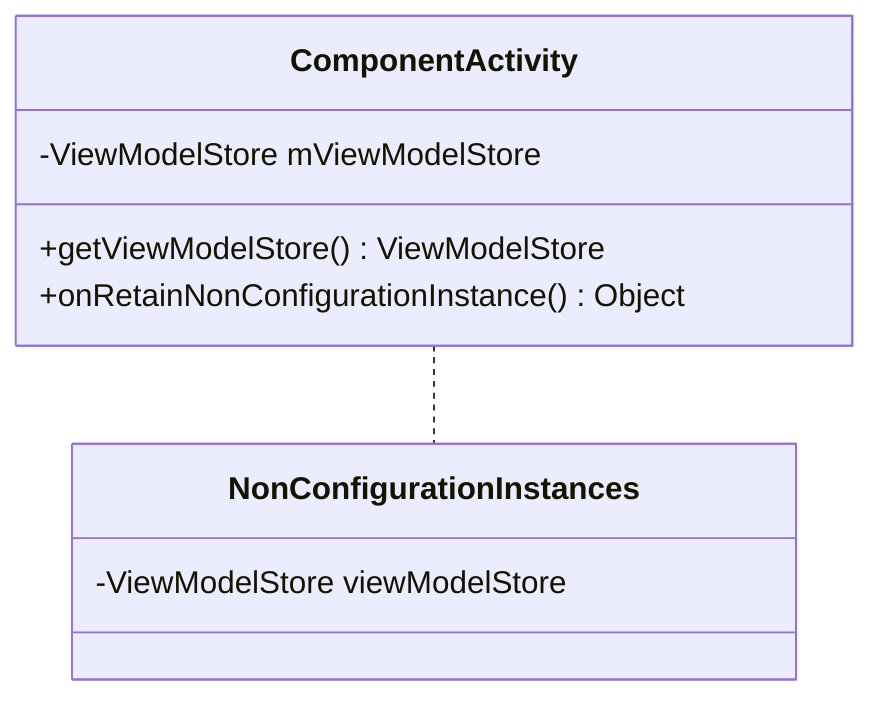
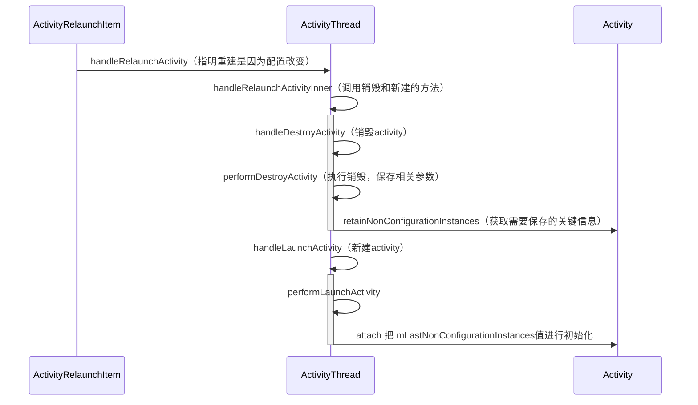
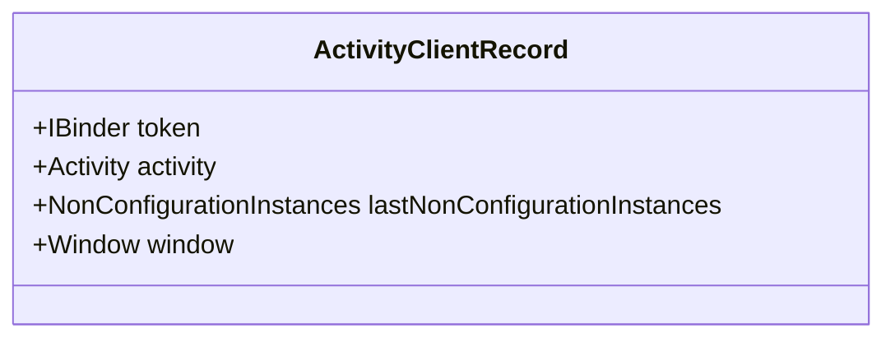

因为在传统的开发模式下，Activity需要负责逻辑处理，又要控制UI显示等等，负责的内容过多，任务比较重。而ViewModel可以很好的帮Activity分担一部分工作，专注于存放于界面相关的数据，一切界面上有关的数据都应该放到ViewModel中进行管理，并且ViewModel 以注重生命周期的方式存储和管理界面相关的数据。ViewModel 类让数据可在发生屏幕旋转等配置更改后继续留存。

## 基本使用

依赖添加

```groovy
implementation "androidx.lifecycle:lifecycle-viewmodel-ktx:2.3.1"
```

主要为界面准备数据，要实现一个ViewModel对象继承至ViewModel即可

```kotlin
class JetPackModel : ViewModel(){
    // 数据以及一些方法
    
    override fun onCleared() {
        super.onCleared()
        // 当不再使用时释放一些资源和解除一些绑定
    }
}
```

然后即可在Activity中初始化
```kotlin
class JetPackActivity : AppCompatActivity() {
    private val model by lazy {
        ViewModelProvider(this)[JetPackModel::class.java]
    }
}
```

若ViewModel需要带有参数，则不再使用默认的Factory，需要自己定义如下

```java
class JetPackModel(val value: String) : ViewModel()

class JetpackModelFactory(val value:String) :ViewModelProvider.Factory{
    override fun <T : ViewModel?> create(modelClass: Class<T>): T {
        val constructor =modelClass.getDeclaredConstructor(String::class.java)
        constructor.isAccessible = true
        return constructor.newInstance(value)
    }
}

class JetPackActivity : AppCompatActivity() {
    private val model by lazy {
        ViewModelProvider(this, JetpackModelFactory("initValue"))[JetPackModel::class.java]
    }
}
```

在Activity中的多个Fragment中访问Activity的ViewModel实例

```java
val model = ViewModelProvider(requireActivity())[JetPackModel::class.java]
```

Fragment也可以创建自己的ViewModel，方法和Activity的相同。

此外还可以添加依赖

```groovy
implementation "androidx.navigation:navigation-ui-ktx:2.3.5"
```

还可以实现更简洁的创建ViewModel对象的形式

```kotlin
private val model : JetPackModel by viewModels()
```

## 生命周期

Activity在旋转时，Activity和ViewModel生命周期的对照，在整个过程中ViewModel都是可以得已保存复用的。


## 实现原理

ViewModel是如何保证Activity销毁重建之后里面的数据得以保留的呢？

首先看一下涉及到的类图

- androidx.lifecycle.ViewModelStore

  ```mermaid
  classDiagram
  	class ViewModelStore{
  		-HashMap<String, ViewModel> mMap
  		~put(String, ViewModel)
  		~get(String) ViewModel
  		+clear()
  	}
  ```

- androidx.activity.ComponentActivity.java



- android.app.Activity

  ```mermaid
  classDiagram
      class Activity{
      	NonConfigurationInstances mLastNonConfigurationInstances
      	+getLastNonConfigurationInstance() Object
      	~attach(NonConfigurationInstances,...)
      }
      class NonConfigurationInstances{
      	-Object activity
      }
      Activity .. NonConfigurationInstances
  ```

  首先从ViewModel的来源入手，ViewModel的创建是由ViewModelProvider的get方法得到的

```java
// ViewModelProvider.java
public <T extends ViewModel> T get(@NonNull Class<T> modelClass) {
    String canonicalName = modelClass.getCanonicalName();
    // 拼出唯一的Key
    return get(DEFAULT_KEY + ":" + canonicalName, modelClass);
}
// ViewModelProvider.java
public <T extends ViewModel> T get(@NonNull String key, @NonNull Class<T> modelClass) {
    // 尝试从mViewModelStore中获取
    ViewModel viewModel = mViewModelStore.get(key);
    // 如果Class类型相同则复用
    if (modelClass.isInstance(viewModel)) {
        return (T) viewModel;
    } 
    // 没有就开始创建
    if (mFactory instanceof KeyedFactory) {
        viewModel = ((KeyedFactory) mFactory).create(key, modelClass);
    } else {
        viewModel = mFactory.create(modelClass);
    }
    // 保存到mViewModelStore中
    mViewModelStore.put(key, viewModel);
    return (T) viewModel;
}
```

首次创建时会通过mFactory来创建并以key-value的形式保存到mViewModelStore中，而再次获取时只需要从mViewModelStore中获取。

那么ViewModelProvider中的mViewModelStore是怎么初始化的呢？

```java
// ViewModelProvider.java
public ViewModelProvider(@NonNull ViewModelStoreOwner owner) {
    this(owner.getViewModelStore(), owner instanceof HasDefaultViewModelProviderFactory
         ? ((HasDefaultViewModelProviderFactory) owner).getDefaultViewModelProviderFactory()
         : NewInstanceFactory.getInstance());
}
// ViewModelProvider.java
public ViewModelProvider(@NonNull ViewModelStore store, @NonNull Factory factory) {
    mFactory = factory;
    mViewModelStore = store;
}
// ComponentActivity.java
public ViewModelStore getViewModelStore() {
    if (mViewModelStore == null) {
        NonConfigurationInstances nc =
            (NonConfigurationInstances) getLastNonConfigurationInstance();
        if (nc != null) {
            mViewModelStore = nc.viewModelStore;
        }
        if (mViewModelStore == null) {
            mViewModelStore = new ViewModelStore();
        }
    }
    return mViewModelStore;
}
// Activity.java
public Object getLastNonConfigurationInstance() {
    return mLastNonConfigurationInstances != null
        ? mLastNonConfigurationInstances.activity : null;
}
```

owner是由构造方法传入的Activity，则mViewModelStore和Activity对象一一对应，所以Activity中的fragment可以很方便的获取到同一个ViewModel。而Activity首先会尝试获取mLastNonConfigurationInstances值中的viewModelStore，而获取不到时再重新创建。

那么mLastNonConfigurationInstances是在何时进行付值的呢？

当配置改变时，若需要需要重建Activity，则App进程的Handler会收到一个ClientTransaction对象，里面会包含ClientTransactionItem抽象类的子类，最后会调用其execute方法进行具体的事件执行。例如常见的子类会有LaunchActivityItem、PauseActivityItem、ActivityRelaunchItem、DestroyActivityItem等，而重建收到的是ActivityRelaunchItem对象，他的execute方法如下：

```java
@Override
public void execute(ClientTransactionHandler client, IBinder token,
                    PendingTransactionActions pendingActions) {
  	client.handleRelaunchActivity(mActivityClientRecord, pendingActions);
}
```

这里的client就是ActivityThread对象，所以先看一下整体的流程图：



在App端记录Activity信息的类



这个是ActivityThread的静态内部类，主要记录了Activity的关键信息，与AMS那边相对应，App端保存到一个ArrayMap中

```java
final ArrayMap<IBinder, ActivityClientRecord> mActivities = new ArrayMap<>();
```

首先是handleRelaunchActivity方法

```java
// ActivityThread.java
public void handleRelaunchActivity(ActivityClientRecord tmp,
            PendingTransactionActions pendingActions) {
    //标志Activity重建是因为配置改变
    r.activity.mChangingConfigurations = true;
    handleRelaunchActivityInner(r, configChanges, tmp.pendingResults, tmp.pendingIntents,
                pendingActions, tmp.startsNotResumed, tmp.overrideConfig, "handleRelaunchActivity");
}
// ActivityThread.java
private void handleRelaunchActivityInner(ActivityClientRecord r, int configChanges,
        List<ResultInfo> pendingResults, List<ReferrerIntent> pendingIntents,
        PendingTransactionActions pendingActions, boolean startsNotResumed,
        Configuration overrideConfig, String reason) {
    // 这第四个参数很关键
    handleDestroyActivity(r.token, false, configChanges, true, reason);
    // 清除上一个record的信息
    r.activity = null;
    r.window = null;
    // 重新启动一个Activity
    handleLaunchActivity(r, pendingActions, customIntent);
}
// ActivityThread.java
ActivityClientRecord performDestroyActivity(IBinder token, boolean finishing,
                                            int configChanges, boolean getNonConfigInstance, String reason) {
    // 再从mActivities中去把这个record查找出来
    ActivityClientRecord r = mActivities.get(token);
    if (r != null) {
        // 这个参数为true，所以调用了activity的retainNonConfigurationInstances方法把值进行保存
        if (getNonConfigInstance) {
            try {
                r.lastNonConfigurationInstances
                    = r.activity.retainNonConfigurationInstances();
            } catch (Exception e) {
                if (!mInstrumentation.onException(r.activity, e)) {
                    throw new RuntimeException(
                        "Unable to retain activity "
                        + r.intent.getComponent().toShortString()
                        + ": " + e.toString(), e);
                }
            }
        }
        r.setState(ON_DESTROY);
    }
    synchronized (mResourcesManager) {
        mActivities.remove(token);
    }
    return r;
}
```

做对比看一下正常Activity销毁时调用的方法。

```java
// DestroyActivityItem.java
public void execute(ClientTransactionHandler client, IBinder token,
        PendingTransactionActions pendingActions) {
    // 这里直接调用handleDestroyActivity且getNonConfigInstance为false，则不会保存
    client.handleDestroyActivity(token, mFinished, mConfigChanges,
            false /* getNonConfigInstance */, "DestroyActivityItem");
}
```

然后再看Activity的retainNonConfigurationInstances方法具体是如何进行保存的

```java
// Activity.java
NonConfigurationInstances retainNonConfigurationInstances() {
    // 获取要保存的对象并保存到nci中
    Object activity = onRetainNonConfigurationInstance();
    NonConfigurationInstances nci = new NonConfigurationInstances();
    if (activity == null && children == null && fragments == null && loaders == null
        && mVoiceInteractor == null) {
        return null;
    }
    nci.activity = activity;
    return nci;
}
// ComponentActivity.java
public final Object onRetainNonConfigurationInstance() {
    ViewModelStore viewModelStore = mViewModelStore;
    if (viewModelStore == null) {
        NonConfigurationInstances nc =
            (NonConfigurationInstances) getLastNonConfigurationInstance();
        if (nc != null) {
            viewModelStore = nc.viewModelStore;
        }
    }
    if (viewModelStore == null && custom == null) {
        return null;
    }
    NonConfigurationInstances nci = new NonConfigurationInstances();
    nci.viewModelStore = viewModelStore;
    return nci;
}
```

在ComponentActivity中重写了Activity的onRetainNonConfigurationInstance方法，使viewModelStore保存到NonConfigurationInstances中进行返回。

然后接下来是重新创建新的Activity实例

```java
// ActivityThread.java
private Activity performLaunchActivity(ActivityClientRecord r, Intent customIntent) {
    Activity activity = null;
    try {
        // 创建一个新的Activity
        activity = mInstrumentation.newActivity(
                cl, component.getClassName(), r.intent);
    } catch (Exception e) {
    }

    try {
        Application app = r.packageInfo.makeApplication(false, mInstrumentation);
        if (activity != null) {
            // 把r.lastNonConfigurationInstances传递给新创建的activity
            activity.attach(appContext, this, getInstrumentation(), r.token,
                    r.ident, app, r.intent, r.activityInfo, title, r.parent,
                    r.embeddedID, r.lastNonConfigurationInstances, config,
                    r.referrer, r.voiceInteractor, window, r.configCallback,
                    r.assistToken);
            // 清空record中的lastNonConfigurationInstances信息
            r.lastNonConfigurationInstances = null;
            r.activity = activity;
        }
        r.setState(ON_CREATE);
        synchronized (mResourcesManager) {
            mActivities.put(r.token, r);
        }
    } catch (SuperNotCalledException e) {
    } catch (Exception e) {
    }

    return activity;
}
// Activity.java
final void attach(Context context, ActivityThread aThread,
        Instrumentation instr, IBinder token, int ident,
        Application application, Intent intent, ActivityInfo info,
        CharSequence title, Activity parent, String id,
        NonConfigurationInstances lastNonConfigurationInstances,
        Configuration config, String referrer, IVoiceInteractor voiceInteractor,
        Window window, ActivityConfigCallback activityConfigCallback, IBinder assistToken) {
    attachBaseContext(context);
    mUiThread = Thread.currentThread();
    // 保存到activity对象中
    mLastNonConfigurationInstances = lastNonConfigurationInstances;
}
```

performLaunchActivity方法中主要是创建一个新的activity，然后对activity进行初始化，然后清空lastNonConfigurationInstances，以及保存record到mActivities中，最后activity对lastNonConfigurationInstances参数进行保存，所以mLastNonConfigurationInstances就有值了，在onCreate方法时再进行ViewModelStore的获取时即可拿到之前的ViewModel对象。

但在Activity中搜索mLastNonConfigurationInstances会发现这样一段代码

```java
// Activity.java
final void performResume(boolean followedByPause, String reason) {
    mLastNonConfigurationInstances = null;
    // 会执行activity的onResume方法
    mInstrumentation.callActivityOnResume(this);
}
```

在调用Activity的onResume方法前就会把mLastNonConfigurationInstances设置为空，那ViewModel的初始化若是在onResume中进行的那么就保存不了了呢？

若写下如下代码进行测试，发现结果并不会像上面分析的一样，旋转屏幕之后仍然可以获取到之前的ViewModel对象

```java
override fun onResume() {
    super.onResume()
    model.count.observe(this) {
        binding.tvClickTime.text = "click time $it"
    }
    binding.tvClickTime.setOnClickListener {
        model.click()
    }
}
```

继续分析代码可以发现在FragmentActivity的onCreate中有这么一段代码

```java
// FragmentActivity.java
final FragmentController mFragments = FragmentController.createController(new HostCallbacks());
protected void onCreate(@Nullable Bundle savedInstanceState) {
    mFragments.attachHost(null /*parent*/);
}

// androidx.fragment.app.FragmentController.java
public void attachHost(@Nullable Fragment parent) {
	mHost.mFragmentManager.attachController(mHost, mHost /*container*/, parent);
}

// androidx.fragment.appFragmentManagerImpl.java
public void attachController(@NonNull FragmentHostCallback host,
                             @NonNull FragmentContainer container, @Nullable final Fragment parent) {
  if (mHost != null) throw new IllegalStateException("Already attached");
  mHost = host;
  if (parent != null) {
    mNonConfig = parent.mFragmentManager.getChildNonConfig(parent);
  } else if (host instanceof ViewModelStoreOwner) {
    //调用了host的getViewModelStore()
    ViewModelStore viewModelStore = ((ViewModelStoreOwner) host).getViewModelStore();
    mNonConfig = FragmentManagerViewModel.getInstance(viewModelStore);
  } else {
    mNonConfig = new FragmentManagerViewModel(false);
  }
}
```

因为host其实实现了ViewModelStoreOwner接口然后桥接了Activity的getViewModelStore()方法，所以这里调用的其实是Activity的getViewModelStore()方法，Activity的mViewModelStore在onCreate中得到了初始化，故ViewModel在onResume中也可以正常使用，同理，若继承的是FragmentActivity的父Activity则就不能正常获取到mViewModelStore对象了。

最后看一下ViewModel的onCleared()是怎么被调用的，怎么保证只有在正常销毁时做数据清理的。

在ComponentActivity的构造方法中

```java
// androidx.activity.ComponentActivity.java
public ComponentActivity() {
    Lifecycle lifecycle = getLifecycle();
    //noinspection ConstantConditions
    if (lifecycle == null) {
        throw new IllegalStateException("getLifecycle() returned null in ComponentActivity's "
                + "constructor. Please make sure you are lazily constructing your Lifecycle "
                + "in the first call to getLifecycle() rather than relying on field "
                + "initialization.");
    }
    // 在Activity执行onDestroy时，调用ViewModel的clear方法
    getLifecycle().addObserver(new LifecycleEventObserver() {
        @Override
        public void onStateChanged(@NonNull LifecycleOwner source,
                @NonNull Lifecycle.Event event) {
            if (event == Lifecycle.Event.ON_DESTROY) {
                // 仅在非配置改变的情况下
                if (!isChangingConfigurations()) {
                    getViewModelStore().clear();
                }
            }
        }
    });
}
// ViewModelStore.java
public final void clear() {
    for (ViewModel vm : mMap.values()) {
        vm.clear();
    }
    mMap.clear();
}
```

## 总结

总的来说ViewModel可以总结为以下几点

- mViewModelStore实际是以键值对的形式储存着ViewModel，key为与类名相关或自定义的字符串，而值则为ViewModel

- 一个Activity对象对应于一个mViewModelStore对象
- 在Activity销毁重建时，ActivityThread使用lastNonConfigurationInstances来将被销毁Activity的数据传递给重建的Activity。
- 在配置改变导致的重建Activity会避免去清除mViewModelStore
