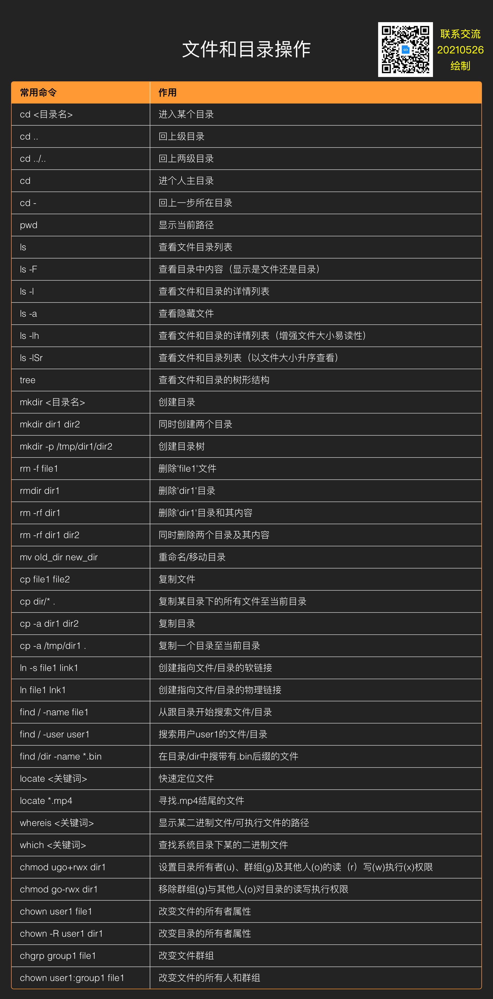
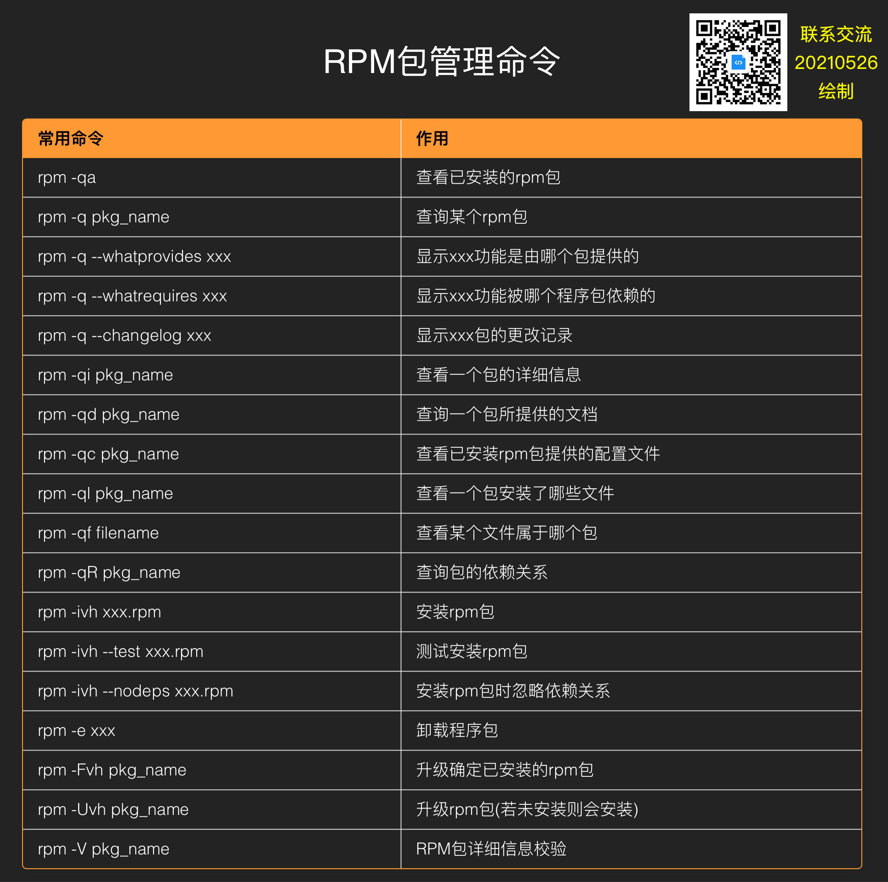
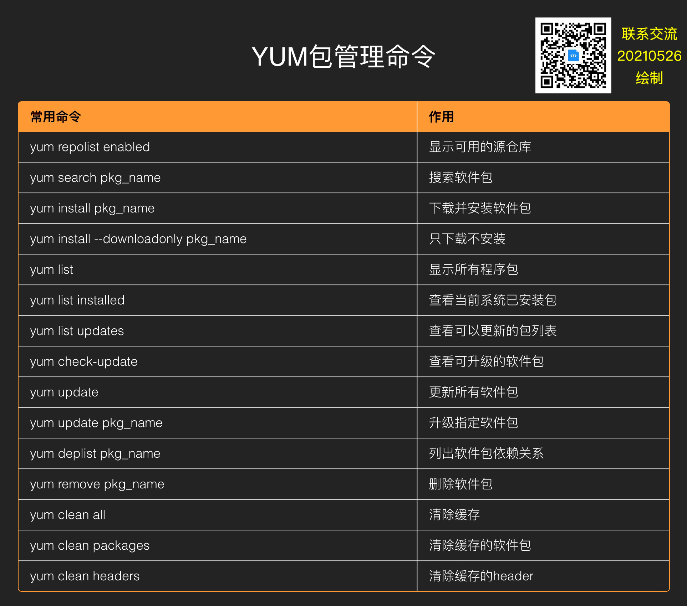

[toc]

## 1. 关机/重启/注销

| 常用命令            | 作用                            |
| ------------------- | :------------------------------ |
| shutdown -h now     | 即刻关机    	                |
| shutdown -h 10      | 10分钟后关机                    |
| shutdown -h 11:00   | 11:00关机                       |
| shutdown -h +10     | 预定时间关机（10分钟之后）      |
| shutdown -c         | 取消指定关机时间                |
| shutdown -r now     | 即刻重启 			|
| shutdown -r 10      | 10分钟后重启 			|
| shutdown -r 11:00   | 11:00重启 			|
| reboot	      | 重启                            |
| init 6	      | 重启                            |
| poweroff 	      | 立刻关机                        |
| init 0              | 立刻关机                        |
| halt                | 关机                            |
| telinit 0           | 关机                            |
| sync                | buff数据同步到磁盘              |
| logout              | 退出登陆Shell                   |

## 2. 系统信息和性能查看

| 常用命令                      | 作用                              |
| ----------------------------- | --------------------------------- |
| uname -a                      | 查看内核/OS/CPU信息               |
| uname -r                      | 查看内核版本                      |
| uname -m                      | 查看处理器架构                    |
| arch                          | 查看处理器架构                    |
| hostname                      | 查看计算机名                      |
| who                           | 显示当前登录系统的用户            |
| who am i                      | 显示当前登录系统的用户            |
| whoami                        | 显示当前用户名                    |
| cat  /proc/version            | 查看linux版本信息                 |
| cat  /proc/cupinfo            | 查看CPU信息                       |
| cat /proc/interrupts          | 查看中断                          |
| cat /proc/loadavg             | 查看系统负载                      |
| uptime                        | 查看系统运行时间、用户数、负载    |
| env                           | 查看系统的环境变量                |
| lsusb -tv                     | 查看系统USB设备信息               |
| lspci -tv                     | 查看系统PCI设备信息               |
| lsmod                         | 查看已加载的系统模块              |
| grep  MemTotal  /proc/meminfo | 查看内存总量                      |
| grep  MemFree  /proc/meminfo  | 查看空闲内存量                    |
| free -m                       | 查看内存用量和交换区用量          |
| date                          | 显示系统日期时间                  |
| cal 2021                      | 显示2021日历表                    |
| top                           | 动态显示cpu/内存/进程等状态       |
| vmstat 1 20                   | 每1秒采集一次系统状态，采集20次   |
| iostat                        | 查看io读写/cpu使用情况            |
| sar -u 1 10                   | 查询cpu使用情况（1秒1次，共10次） |
| sar -d 1 10                   | 查询磁盘性能                      |

## 3. 磁盘和分区

| 常用命令                              | 作用                               |
| ------------------------------------- | ---------------------------------- |
| fdisk -l                              | 查看所有磁盘分区                   |
| swapon -s                             | 查看所有交换分区                   |
| df -h                                 | 查看磁盘使用情况及挂载点           |
| df -hl                                | 查看磁盘使用情况及挂载点           |
| du -sh /dir                           | 查看指定某个目录的大小             |
| du -sk *                              | 从高到低依次显示文件大小和目录大小 |
| mount  /dev/hda2/mnt/hda2             | 挂载hda2盘                         |
| mount -t ntfs  /dev/sdc 1 /mnt/usbhd1 | 指定文件系统类型挂载（如ntfs）     |
| mount -o loop xxx.iso /mnt/cdrom      | 挂载iso文件                        |
| mount /dev/sda1 /mnt/usbdisk          | 挂载usb盘/闪存设备                 |
| umount -v /dev/sda1                   | 通过设备名卸载                     |
| umount -v /mnt/mymnt                  | 通过挂载点卸载                     |
| fuser -km /mnt/hda1                   | 强制卸载                           |

## 4. 用户和用户组

| 常用命令                                         | 作用                                          |
| ------------------------------------------------ | --------------------------------------------- |
| useradd jiangker                                 | 创建用户                                      |
| userdel -r jiangker                              | 删除用户                                      |
| usermod -g group_name user_name                  | 修改用户的组                                  |
| usermod -aG group_name user_name                 | 将用户添加到组                                |
| usermod -s /bin/ksh -d /home/jfp -g dev jiangker | 修改用户jiangker的登录shell、主目录以及用户组 |
| groups test                                      | 查看test用户所在的组                          |
| groupadd group_name                              | 创建用户组                                    |
| groupdel group_name                              | 删除用户组                                    |
| groupmod -n new_name old_name                    | 重命名用户组                                  |
| su - user_name                                   | 完整切换到一个用户环境                        |
| passwd                                           | 修改口令                                      |
| passwd jiangker                                  | 修改某用户的口令                              |
| w                                                | 查看活跃用户                                  |
| id jiangker                                      | 查看指定用户的信息                            |
| last                                             | 查看用户登录日志                              |
| crontab -l                                       | 查看当前用户的计划任务                        |
| cut -d: -f1 /etc/passwd                          | 查看系统所有用户                              |
| cut -d: -f1 /etc/group                           | 查看系统所有组                                |

## 5. 网络和进程管理

| 常用命令                                                     | 作用                                 |
| ------------------------------------------------------------ | ------------------------------------ |
| ifconfig                                                     | 查看网络接口属性                     |
| ifconfig eth0                                                | 查看某网卡的配置                     |
| route -n                                                     | 查看路由表                           |
| netstat -lntp                                                | 查看所有监听端口                     |
| netstat -antp                                                | 查看已经建立的TCP链接                |
| netstat -lutp                                                | 查看TCP/UDP的状态信息                |
| ifup eth0                                                    | 启动eth0网络设备                     |
| ifdown eth0                                                  | 禁用eth0网络设备                     |
| iptables -L                                                  | 查看iptables规则                     |
| ifconfig eth0 192.168.1.1 netmask 255.255.255.0              | 配置ip地址                           |
| dhclient eth0                                                | 以dhcp模式启动eth0                   |
| route add -net 0/0 gw Gateway_IP                             | 配置默认网关                         |
| route add net 192.168.0.0 netmask 255.255.255.0 gw 192.168.1.1 | 配置静态路由到达网络‘192.168.0.0/16’ |
| route del 0/0 gw Gateway_IP                                  | 删除静态路由                         |
| hostname                                                     | 查看主机名                           |
| host www.snownet.cn                                          | 解析主机名                           |
| nslookup www.snownet.cn                                      | 查询DNS记录，查看域名解析是否正常    |
| ps -ef                                                       | 查看所有进程                         |
| ps -ef \| group jiangker                                     | 过滤出所需要的进程                   |
| kill -s name                                                 | kill指定名称的进程                   |
| kill -s pid                                                  | kill指定pid的进程                    |
| top                                                          | 实时显示进程状态                     |
| vmstat 1 20                                                  | 没1秒采集一次系统状态，采集20次      |
| iostat                                                       | 查看io读写/cpu使用情况               |
| sar -u 1 10                                                  | 查询cpu使用情况（1秒一次，共10次）   |
| sar -d 1 10                                                  | 查询磁盘性能                         |

## 6. 常见系统服务命令

| 常用命令                   | 作用         |
| -------------------------- | ------------ |
| chkconfig --list           | 列出系统服务 |
| service <服务名> status    | 查看某个服务 |
| service <服务名> start     | 启动某个服务 |
| service <服务名> stop      | 终止某个服务 |
| service <服务名> restart   | 重启某个服务 |
| systemctl status <服务名>  | 查看某个服务 |
| systemctl stop <服务名>    | 启动某个服务 |
| systemctl restart <服务名> | 终止某个服务 |
| systemctl enable <服务名>  | 开启自启动   |
| systemctl disable <服务名> | 关闭自启动   |

## 7. 文件查看和处理

| 常用命令                    | 作用                                      |
| --------------------------- | ----------------------------------------- |
| cat file 1                  | 查看文件内容                              |
| cat -n file 1               | 查看内容并标示行数                        |
| cat xxx.txt                 | awk 'NR%2==1'                             |
| tac file 1                  | 从最后一行开始反看文件内容                |
| more file 1                 | 查看一个长文件的内容                      |
| less file 1                 | 类似more命令，但允许反向操作              |
| head -2 file 1              | 查看文件前两行                            |
| tail -2 file 1              | 查看文件后两行                            |
| tail -f /log/msg            | 实时查看添加到文件中的内容                |
| grep jiangker hello.txt     | 在文件hello.txt中查找关键字jiangker       |
| grep ^jiangker hello.txt    | 在文件hello.txt中查找以jiangker开头的内容 |
| grep [0-9] hello.txt        | 选择hello.txt文件中所有包含数字的行       |
| sed 's/s1/s2/g' hello.txt   | 将hello.txt文件中的s1替换成s2             |
| sed '/^$/d' hello.txt       | 从hello.txt文件中删除所有空白行           |
| sed '/*#/d;/^$/d' hello.txt | 从hello.txt文件中删除所有注释和空白行     |
| sed -e '1d' hello.txt       | 从文件hello.txt中排出第一行               |
| sed -n '/s1/p' hello.txt    | 查看只包含关键字“s1”的行                  |
| sed -e 's/*$//' hello.txt   | 删除每一行最后的空白字符                  |
| sed -e 's/s1//g' hello.txt  | 从文档中删除词汇s1并保留剩余全部          |
| sed -n '1,5p;5q' hello.txt  | 查看从第一行到第五行的内容                |
| sed -n '5p;5q' hello.txt    | 查看第五行                                |
| paste file1 file2           | 合并两个文件或两栏的内容                  |
| paste -d '+' file1 file2    | 合并两个文件或两栏的内容，中间用'+'区分   |
| sort file1 file2            | 排序两个文件的内容                        |
| comm -1 file1 file2         | 比较两个文件的内容(去除file1所包含的内容) |
| comm -2 file1 file2         | 比较两个文件的内容(去除file2所包含的内容) |
| comm -3 file1 file2         | 比较两个文件的内容(去除两个文件共有部分)  |

## 8. 文件和目录操作

## 9. 打包和解压

## 10. RPM包管理命令

## 11. YUM包管理命令

## 12. DPKG包管理命令

## 13. APT软件工具

